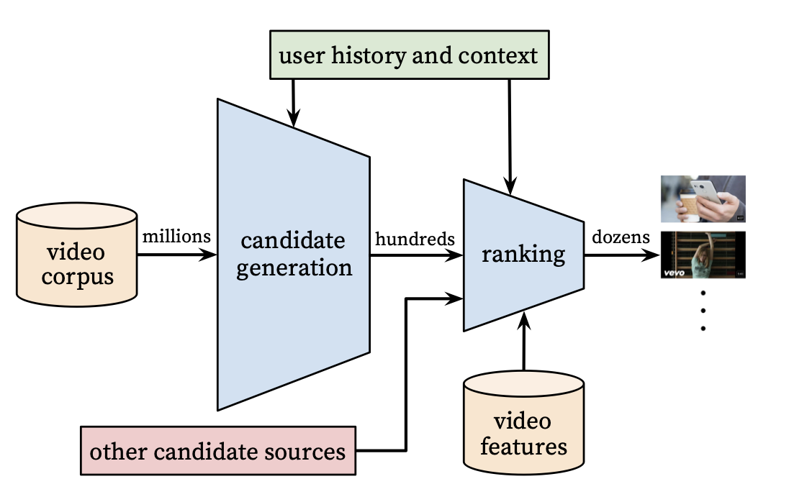
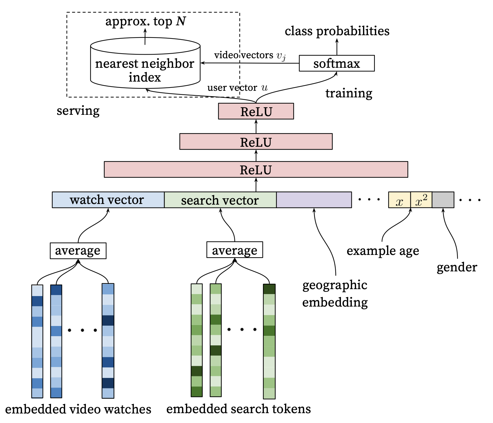
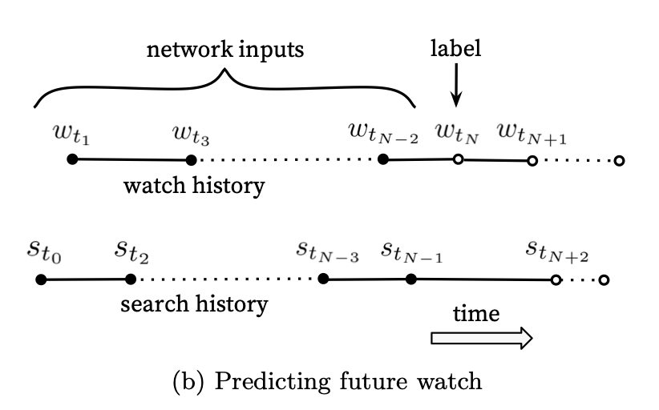
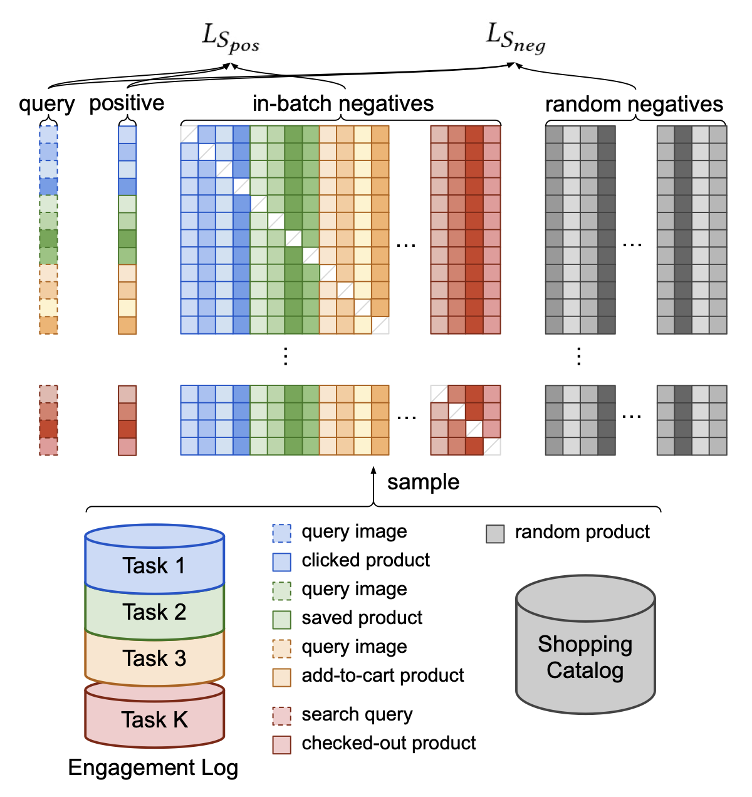
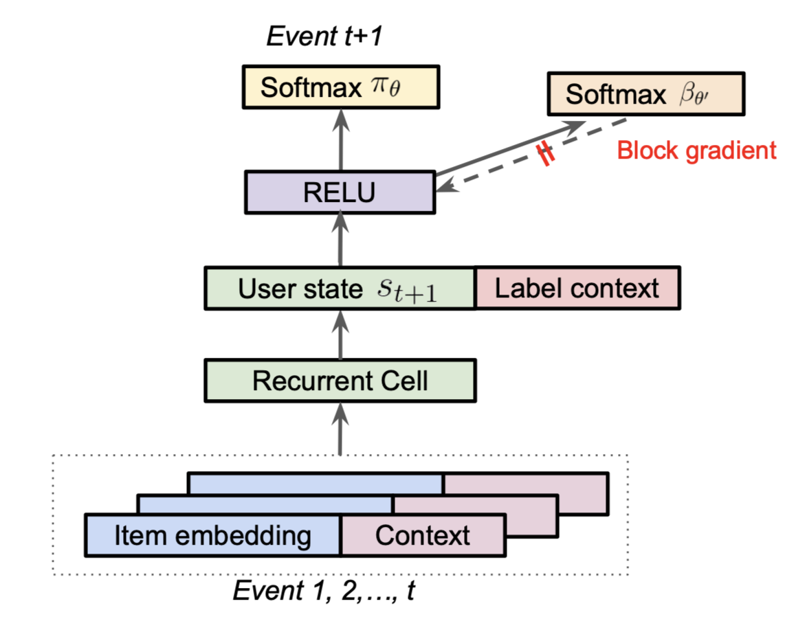

Sometimes I'm asked how to start learning about recommender systems, and there's a few go-to papers I always mention; however, without a proper map, it could be alittle difficult for the uninitiated. So, to try to make a gentle introduction, I will walk through an implementation of the candidate generation model based on [Deep Neural Networks for YouTube](https://static.googleusercontent.com/media/research.google.com/en//pubs/archive/45530.pdf). This paper (and its talk) is jam-packed with all sorts of interesting practical recommendation system knowledge and is the perfect starting place for people hoping to understand large-scale recommendation systems. I will implement the key components of the candidate generation model and train the model on the [MovieLens](https://grouplens.org/datasets/movielens/) dataset in PyTorch, a typical benchmark dataset in the RecSys space. There will also be a few modern flourishes and comments on new developments as applicable. I'll conclude with outlining a natural extension to this approach to predict multiple outcomes.

## Candidate Generation

A recommendation system is like a funnel that starts from the largest pool of content avaialble to a user and filters until we get the right set of items to show to a user. From the paper, they have the following graphic that illustrates the process well:



Our goal is to find items in the (possible) billions of possible items to present to the user to improve upon given business metrics.


### Modeling

For the uninitiated, recommendation systems are basically a vector search if you squint at it. We represent users and items as vectors and then that is how we can scale the search to very large item sets. The first step in the pipeline is the candidate generation where a user vector is generated and used to look up candidate items via approximate nearest neighbor techniques (e.g., [Hierarchical Navigatable Small Worlds](https://arxiv.org/ftp/arxiv/papers/1603/1603.09320.pdf)). In the Youtube paper, this is modeled as a _big softmax_, where every item corresponds to an index in the softmax's output. 



For training, the dense layer for the softmax would become prohibitivelty large, and so variations on a sampled softmax are typically used. Indeed, even the input embedding layers have a similar issues, and more modern techniques would use things like [Hash Embeddings](https://papers.nips.cc/paper_files/paper/2017/file/f0f6ba4b5e0000340312d33c212c3ae8-Paper.pdf) and other tricks to reduce the size of the embedding table (e.g., see [TikTok describe its collisionless embedding table](https://arxiv.org/pdf/2209.07663.pdf])). In my implementation, I will use a _simplified_ shared hash embeddings to represent both the input IDs and the softmax output, combined with sampled softmax. Shared embeddings is a common technique used in such systems and can improve generalization, as stated in the Youtube paper in Section 4.1:
> Sharing embeddings is important for improving generalization, speeding up training and reducing memory requirements. The overwhelming majority of model parameters are in these high-cardinality embedding spaces - for example, one million IDs embedded in a 32 dimensional space have 7 times more parameters than fully connected layers 2048 units wide.

You will notice in my implementation I allow variable length watch histories up to length `max_pad`=30. I do this by looping over the inputs, applying the embedding layer, and then averaging the inputs. Treating items as a "bag of words" is a common approach in early recommender systems, especially before the onset of Transformers and efficient RNNs. The approach is still extremely effective when combined with side features, such as in the Deep Nets Youtube paper and the [Wide and Deep paper](https://arxiv.org/pdf/1606.07792.pdf).


```python
import torch
import torch.nn as nn
import torch.nn.functional as F
import hashlib
import pandas as pd
import numpy as np

EMBED_TABLE_SIZE = 1000
hash_f = lambda x: int(hashlib.md5(x.encode('utf-8')).hexdigest(),16) % EMBED_TABLE_SIZE
mps_device = torch.device("mps")
max_pad=30
```


```python
class DeepNetRecommender(nn.Module):
    def __init__(self, n_embed=3, table_size=EMBED_TABLE_SIZE, embed_dim=64):
        super(DeepNetRecommender, self).__init__()
        # MUST DEFINE ALL LAYERS IN THE BODY OR PYTORCH DOESNT NOTICE THEM
        self.embed1 = nn.Embedding(table_size, embed_dim)
        self.embed2 = nn.Embedding(table_size, embed_dim)
        self.embed3 = nn.Embedding(table_size, embed_dim)
        # need to set seed for it to be the same, fuck
        np.random.seed(182)
        self.embeds = [(getattr(self,'embed'+str(k)),np.random.choice(100000)) for k in range(1,1+n_embed)] # (layer, salt)

        self.model = nn.Sequential(nn.Linear(64,64), nn.ReLU(), nn.Linear(64,64), nn.ReLU(), nn.Linear(64,64)) 
        
    def embed(self, x, max_pad):
        o = None
        for embedder, salt in self.embeds:
            items = [hash_f(str(salt) + '_' + str(k)) for k in x][:max_pad]
            hashed_items = torch.IntTensor(items).to(mps_device)
            embedded = embedder(hashed_items)
            if o is None:
                o = embedded
            else:
                o += embedded
        return o
    
    def embed_stack(self, x):
        return torch.stack([self.embed(k, max_pad=len(k)) for k in x],0)

    def _embed_transform(self, y, max_pad):
        # embeds variable length inputs and translate them to the same size, [1,64] via averaging
        x = self.embed(y, max_pad)
        return torch.sum(x,0) / x.shape[-1]
        
    def embed_and_avg(self, data, max_pad):
        stacked = torch.stack([self._embed_transform(x, max_pad) for x in data],0)
        return stacked.unsqueeze(1)
        
    def forward(self, x):
        # Pad, stack and embed vectors
        inps = x['history']
        to_rank = x['to_rank']

        lhs = self.embed_and_avg(inps, max_pad)
        rhs = self.embed_stack(to_rank)

        output = torch.bmm(lhs, rhs.T.permute(-1,0,1))
        return output.squeeze(1)

```

As I mentioned before, we are using a sampled softmax approach. If your softmax output dimension is one-to-one with your item catalog, you can use functions build into PyTorch to sample indices. To create the sampled softmax, I reuse the simplifieds hash embedding by dotting the item vector with the user embedding, and therefore, I have to explicitly pass in valid item IDs to ensure I am learning embeddings on the items I care about. In practice, it's more likely to see the output item vectors independent of the inputs for these types of models as it allows for easier sampling without knowing the identifiers of the items you are sampling.


```python
model = DeepNetRecommender().to(mps_device)

with torch.no_grad():
    print(
        model({'history': [[1,182,1930]], 'to_rank': [[1,8,24,1234,53435,1000000]]}).cpu().detach()
    )
```

    tensor([[ 3.3182, -0.1267, -0.1815, -0.1327, -0.0200, -0.4532]])


### Data Processing

There are two approaches to modeling the data presented in the paper. I will focus on the one I find works best in practice-- the "predicting the future watch":



Here, you take all the information leading up to a watch as your inputs and predict the item that will be watched. Notice, this approach only requires _positive_ samples as the softmax will imply the other examples are the _negatives_. We will use the MovieLens dataset, sorted by time, and do a groupby on each user to get a big ordered list for each user. Then in our training loop, we will sample an index as our watch item and generate the appropriate history window (considering our `max_pad` parameter). We will do all this in a custom `DataLoader` class. Here I will also sample item IDs in the data loader and output them as the `label` and pass that into the model during training to score each label ID. For the sampled softmax, we will take `1000` items in total to calculate the loss for each training instance.


```python
d = pd.read_csv('data/ratings.csv')
```


```python
n_movies = d.movieId.nunique()
all_movies = d.movieId.unique().tolist()
n_movies
```


    83239


```python
d['click'] = d['rating'] >= 3 # Ratings bigger than 3 we consider a click/watch
dd = d[d['click'] > 0].groupby('userId', as_index=False).movieId.apply(list) # assumes final list is in order
dd.set_index('userId',inplace=True)
dd=dd[dd.movieId.apply(len) > max_pad+2] # minimum number of movies per user
```


```python
from torch.utils.data import Dataset
class MovieLensDataset(Dataset):
    def __init__(self, user_level_data, random_negatives=999):
        self.d = user_level_data
        self.rn = random_negatives
    
    def __len__(self):
        return len(self.d)

    def __getitem__(self, idx):
        user_movies = dd.iloc[idx]['movieId']
        label_idx = np.random.choice(range(1,len(user_movies)))
        history = user_movies[label_idx-max_pad:label_idx]
        label_movie_id = user_movies[label_idx]
        # sample real movie ids so we get reasonable embedding lookups.. as it's not a true softmax
        to_rank = [label_movie_id] + np.random.choice(all_movies, self.rn).tolist()
        start_idx = label_idx-max_pad if label_idx-max_pad > 0 else 0
        movies = user_movies[start_idx:label_idx]
        if len(movies) == 0:
            print('FAIL', label_idx, start_idx, t_rank)
        return movies, to_rank
```

## Training

This section is mostly boilerplate PyTorch code.


```python
from torch.utils.tensorboard import SummaryWriter

# default `log_dir` is "runs" - we'll be more specific here
writer = SummaryWriter('runs/experiment_1')

loss_fn = torch.nn.CrossEntropyLoss() # not equiv to Keras CCE https://discuss.pytorch.org/t/categorical-cross-entropy-loss-function-equivalent-in-pytorch/85165/11
optimizer = torch.optim.Adam(model.parameters(), lr=0.01)
dd['train'] = np.random.uniform(0,1, len(dd)) < .9
                                
dataset=MovieLensDataset(dd[dd['train']])
val_dataset=MovieLensDataset(dd[~dd['train']])

def my_collate(batch):
    data = [item[0] for item in batch]
    target = [item[1] for item in batch]
    target = target
    return [data, target]
    
trainloader = torch.utils.data.DataLoader(dataset, batch_size=256, drop_last=True,
                                        shuffle=True, collate_fn = my_collate)
testloader = torch.utils.data.DataLoader(val_dataset, batch_size=256, drop_last=True,
                                        shuffle=True, collate_fn = my_collate)
```


```python
def train_one_epoch(epoch_index, tb_writer):
    running_loss = 0.
    last_loss = 0.

    for i, data in enumerate(trainloader):
        inputs, labels = data
        optimizer.zero_grad()

        # Make predictions for this batch

        outputs = model({'history': inputs, 'to_rank':labels})

        # Compute the loss and its gradients
        default_label = torch.zeros((outputs.shape[0]), dtype=torch.long).to(mps_device)
        loss = loss_fn(outputs, default_label)
        loss.backward()
        
        # Adjust learning weights
        optimizer.step()

        # Gather data and report
        l = loss.item()
        running_loss += l
        if i % 100 == 99:
            last_loss = running_loss / 100 # loss per batch
            print('  batch {} loss: {}'.format(i + 1, last_loss))
            tb_x = epoch_index * len(trainloader) + i + 1
            tb_writer.add_scalar('Loss/train', last_loss, tb_x)
            running_loss = 0.

    return last_loss
```


```python
fixed_validation_set = [vdata for vdata in testloader]

for epoch_number in range(5):

    model.train()
    avg_loss = train_one_epoch(1, writer)

    running_vloss = 0.0
    model.eval()

    with torch.no_grad():
        for i, vdata in enumerate(fixed_validation_set):
            vinputs, vlabels = vdata
            voutputs = model({'history': vinputs, 'to_rank':vlabels})
            default_label = torch.zeros((voutputs.shape[0]), dtype=torch.long).to(mps_device)
            vloss = loss_fn(voutputs, default_label)
            running_vloss += vloss

    avg_vloss = running_vloss / (i + 1)
    print('LOSS train {} valid {}'.format(avg_loss, avg_vloss))

    writer.add_scalars('Training vs. Validation Loss',
                    { 'Training' : avg_loss, 'Validation' : avg_vloss },
                    epoch_number + 1)
    writer.flush()

    torch.save(model, 'model.pt' +'_' +'_'.join([str(k[1]) for k in model.embeds]) +'.pt' ) # save model with hashes
```

      batch 100 loss: 7.906899147033691
      batch 200 loss: 6.511155738830566
      batch 300 loss: 5.8766823625564575
      batch 400 loss: 5.510434508323669
      batch 500 loss: 5.327098736763
    LOSS train 5.327098736763 valid 5.093747615814209
      batch 100 loss: 5.077551589012146
      batch 200 loss: 4.996584062576294
      batch 300 loss: 4.923203115463257
      batch 400 loss: 4.817293519973755
      batch 500 loss: 4.782714262008667
    LOSS train 4.782714262008667 valid 4.679518222808838
      batch 100 loss: 4.733731045722961
      batch 200 loss: 4.684506363868714
      batch 300 loss: 4.6247485160827635
      batch 400 loss: 4.632119636535645
      batch 500 loss: 4.5745955848693844
    LOSS train 4.5745955848693844 valid 4.506914138793945
      batch 100 loss: 4.592239089012146
      batch 200 loss: 4.5399451208114625
      batch 300 loss: 4.557825055122375
      batch 400 loss: 4.498872952461243
      batch 500 loss: 4.51023015499115
    LOSS train 4.51023015499115 valid 4.395785808563232
      batch 100 loss: 4.4484495401382445
      batch 200 loss: 4.454723727703095
      batch 300 loss: 4.42571882724762
      batch 400 loss: 4.452210640907287
      batch 500 loss: 4.455954210758209
    LOSS train 4.455954210758209 valid 4.345823287963867


### Example Prediction


```python
movies = pd.read_csv('data/movies.csv')
movies.set_index('movieId',inplace=True)
```


```python
def map_movies_list(x):
    return [movies.loc[k,'title'] for k in x]
```


```python
all_movies_scored = model({'history': [dd.iloc[0].movieId[:max_pad]], 'to_rank': [list(movies.index)]})
```


```python
print('User Movies','\n', map_movies_list(dd.iloc[0].movieId[:max_pad]))
```

    User Movies 
     ['Toy Story (1995)', 'Braveheart (1995)', 'Casper (1995)', 'Star Wars: Episode IV - A New Hope (1977)', 'Forrest Gump (1994)', 'When a Man Loves a Woman (1994)', 'Pinocchio (1940)', 'Die Hard (1988)', 'Ghost and the Darkness, The (1996)', 'Shall We Dance (1937)', 'Star Wars: Episode V - The Empire Strikes Back (1980)', 'Aliens (1986)', 'Star Wars: Episode VI - Return of the Jedi (1983)', 'Alien (1979)', 'Indiana Jones and the Last Crusade (1989)', 'Star Trek IV: The Voyage Home (1986)', 'Sneakers (1992)', 'Shall We Dance? (Shall We Dansu?) (1996)', 'X-Files: Fight the Future, The (1998)', 'Out of Africa (1985)', 'Last Emperor, The (1987)', 'Saving Private Ryan (1998)', '101 Dalmatians (One Hundred and One Dalmatians) (1961)', 'Lord of the Rings, The (1978)', 'Elizabeth (1998)', 'Notting Hill (1999)', 'Sixth Sense, The (1999)', 'Christmas Story, A (1983)', "Boys Don't Cry (1999)", 'American Graffiti (1973)']


```python
print('Predicted Top 20 Movies', '\n', movies.title.values[np.argsort(all_movies_scored.cpu().detach().numpy())[0][::-1]][:20])
```

    Predicted Top 20 Movies 
     ['Star Wars: Episode V - The Empire Strikes Back (1980)'
     'Back to the Future (1985)'
     'Star Wars: Episode VI - Return of the Jedi (1983)' 'Matrix, The (1999)'
     'Few Good Men, A (1992)' 'Princess Bride, The (1987)'
     'Men in Black (a.k.a. MIB) (1997)' 'Aliens (1986)'
     'Raiders of the Lost Ark (Indiana Jones and the Raiders of the Lost Ark) (1981)'
     'Independence Day (a.k.a. ID4) (1996)' 'Romancing the Stone (1984)'
     'Rising Sun (1993)' 'Star Wars: Episode I - The Phantom Menace (1999)'
     'Willow (1988)' 'Terminator, The (1984)' 'L.A. Confidential (1997)'
     'Contact (1997)' 'Sixth Sense, The (1999)' 'True Grit (1969)'
     'Groundhog Day (1993)']


## Extensions 

### Predicting Multiple Outcomes

In our model, we are only predicting if the user will watch an item or not. It may be that you want to predict various outcomes, like a click, a save, a buy, etc. One approach is modeling outcomes as prediction tasks demonstrated by Pinterest in their [ItemSage paper](https://arxiv.org/pdf/2205.11728.pdf). Here, they extend the basic model by adding an input term for the outcome they are predicting and embed that for each example. Then, they leverage both in-batch negatives and random negatives to train their model end-to-end. The in-batch negatives help the model learn the difference between popular items where the random negatives help to push down (i.e., rank lower) long-tail irrelevant items during inference. The [LogQ Correction](https://storage.googleapis.com/gweb-research2023-media/pubtools/pdf/6417b9a68bd77033d65e431bdba855563066dc8c.pdf) paper has more specific details on implementing the random negative sampling with in-batch negatives if needed. 



### Off-Policy Reinforcement Learning 

Minmin Chen, the author of [Top-K Off-Policy Correction for a REINFORCE Recommender System](https://research.google/pubs/top-k-off-policy-correction-for-a-reinforce-recommender-system/), said the model from the paper was the single biggest launch in terms of metric improvements at YouTube for that year in her talk on the topic. The recommender system is modeled as a Reinforcement Learning problem and they leverage techniques from the off-policy learning literature to correct for the "behavior policy" (i.e., their production system) which generated and biased their data. Another way to put this is that they use Inverse Propensity Scoring (IPS) in a clever way to correct for biases in their training data, allowing them to properly optimize their desired loss on their data distribution. In their approach, they learn the behavior policy as a separate task during training:



One interesting note above is concatenate a `label context` to the final user state from the RNN, which is one way to implement the multiple tasks from the previous section.


