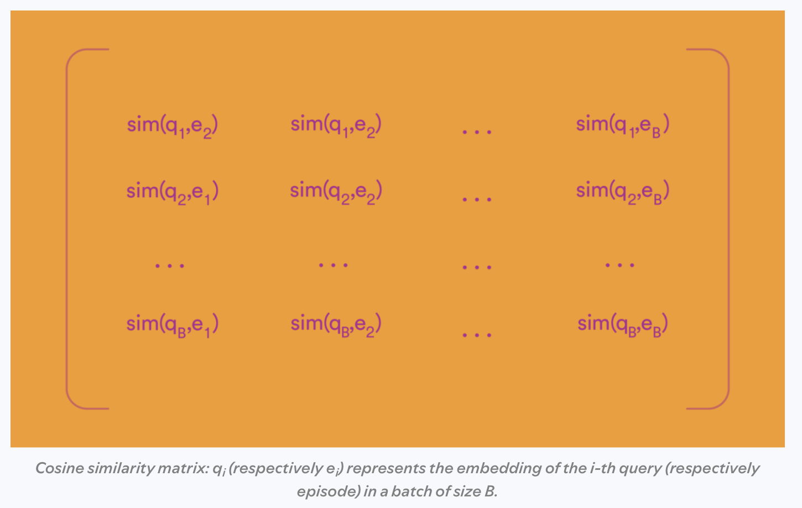

Consider the retrieval problem in a recommendation system. One way to model the problem is to create a big classification model predicting the next item a user will click or watch. This basic approach could be extended to large catalogs via a sampled softmax loss, as discussed in our last post. Naturally, the resulting dataset will only contain positive examples (i.e., what was clicked). In this post, we explore a more optimized version of this approach for more complex models via in-batch negatives. We derive the LogQ Correction to improve the estimate of the gradient and present code in PyTorch to implement the method, building on the previous blog post.


## Motivation

The softmax output is a natural choice for predicting the next click/watch as the softmax is meant to estimate the probability of an event
$$\begin{equation}P(X=x)=\frac{ e^{-\mathcal{E}_\theta (x)} }{ \sum_{x^\prime \in X}  e^{-\mathcal{E}_\theta (x^\prime)}},\end{equation}$$
where $$\mathcal{E}_\theta:=\mathcal{E}$$ represents the logit output of our neural network. To calculate $$P(x)$$, you need to calculate $$Z$$. If you sample negatives uniformly, this is easy to do, as the sampled estimate is unbiased. However, as models get more advanced, you won't only include features on the user but also in the candidate items. Indeed, this is the typical setup for a "two-tower" model like from this [paper](https://storage.googleapis.com/gweb-research2023-media/pubtools/6090.pdf) from Google will have an entire tower for the item embedding:  


Essentially, for each input user and each clicked item, you form the outer product where you dot each vector together to form the matrix $$[\text{sim}(u_i, v_j)]_{i,j=1}^n$$, where the similarity function could be the dot product between the user and item embedding. Here's an image from Spotify's blog post to illustrate the similarity matrix:
. Then, each row essentially forms the data for the softmax loss on the batch. 

This approach is efficient but comes with some downsides. First, positive examples will show up more often in your data, and so they will more often be used as negative examples, skewing their popularity. Second, some items which are never or rarely clicked must still be accounted for, or else they may end up being ranked highly by accident, as they've never been seen before. When you are finetuning language models, the second issue is not as big of a problem, but for recommender systems it is generally recommended to include some negative samples as well, which is done by both [Google](https://storage.googleapis.com/gweb-research2023-media/pubtools/6090.pdf) and [Pinterest](https://arxiv.org/pdf/2205.11728). For today's post, we will build the starter model without the addition of random negatives.

In order to correct for the first problem, we can apply the LogQ Correction ([Sampling-Bias-Corrected Neural Modeling for Large Corpus Item Recommendations
](https://storage.googleapis.com/gweb-research2023-media/pubtools/5716.pdf)) to correct for any probabilistic discrepencies that arise from popular items showing up more often in training. This allows us to efficiently use our minibatch examples while maintaining the proper gradient for training. 

In the next section, we will derive and sketch the proof for the correction term. Then we will implement a version of the correction on the MovieLens dataset.


## LogQ Correction Term Derivation

In order to avoid this problem of popular items being used as negatives, we will adjust the logits with a correction term that will properly estimate the gradient as if we calculated it over the whole dataset. Back to our $$P(X=x)$$ equation. We will assume $$x$$ is our (clicked) item from production logs $$X$$, and $$\mathcal{E}$$ is our logit output which depends on an unwritten model parameters $$\theta$$ and user $$u$$. For convenience, we define the normalizing constant $$Z= \sum_{x^\prime \in X}  e^{-\mathcal{E}_\theta (x^\prime)}$$.
If we consider the cross entropy loss (loosely following the notation in [Benigio 2007](https://www.iro.umontreal.ca/~lisa/pointeurs/importance_samplingIEEEtnn.pdf]) we have
$$\begin{equation}
\ell(x) = -\text{log} P(x) := -\text{log} \frac{ e^{-\mathcal{E}_\theta (x)} }{ \sum_{x^\prime \in X}  e^{-\mathcal{E}_\theta (x^\prime)}}.
\end{equation}$$
The training process considers the gradient of this loss, which can be computed by using properties of the logarhythm and its derivative
$$\begin{align}
\nabla \ell(x) =& \nabla_\theta \left(  -\text{log} \frac{ e^{-\mathcal{E}_\theta (x)} }{ \sum_{x^\prime \in X}  e^{-\mathcal{E}_\theta (x^\prime)}} \right ) \\
 =& \nabla_\theta \left(  \mathcal{E}_\theta (x)  + \text{log} \sum_{x^\prime \in X}  e^{-\mathcal{E}_\theta (x^\prime)} \right ) \\
 = & \nabla_\theta  \mathcal{E}_\theta (x) + \frac{\nabla Z}{Z} \\
 =& \nabla_\theta \mathcal{E}_\theta (x) + \frac{\sum_{x^\prime\in X} \nabla e ^{-\mathcal{E}_\theta(x^\prime)}}{Z} \\
 =& \nabla_\theta \mathcal{E}_\theta (x) - \frac{\sum_{x^\prime\in X} e ^{-\mathcal{E}_\theta(x^\prime)}\nabla_\theta\mathcal{E}_\theta(x^\prime)}{Z} \\
  =& \nabla_\theta \mathcal{E}_\theta (x) - \sum_{x^\prime\in X} P(x^\prime)\nabla_\theta\mathcal{E}_\theta(x^\prime).\\
\end{align}$$

Notice, the negative part of this equation is actually
$$\begin{equation}N := \mathbb{E}_{x\sim X} \nabla_\theta \mathcal{E}(x).\end{equation}$$

Using a technique called weighted importance sampling, we can actually use the minibatch to estimate $$N$$. For a minibatch $$Q$$, let $$Q(x)$$ be the probability that $$x\in Q$$. Then we define the weight $$w$$ as $$w(x)= e^{-\mathcal{E}(x)}/Q(x)$$. This weight has two important properties that we will leverage, namely

$$\begin{equation}\mathbb{E}_Q w(x) = \sum_{x\in X} \frac{e^{-\mathcal{E}(x)}}{Q(x)}Q(x)  = Z \sum_{x\in X} \frac{e^{-\mathcal{E}(x)}}{Z}= Z \end{equation}$$

since $$\sum_x P(x)= 1$$ by definition and for any $$g$$,

$$\begin{equation}\mathbb{E}_Q w(x) g(x) = \sum_{x\in X} \frac{e^{-\mathcal{E}(x)}g(x)}{Q(x)}Q(x)  = Z \sum_{x\in X} \frac{e^{-\mathcal{E}(x)}g(x)}{Z}= Z \mathbb{E}_x g(x). \end{equation}$$

Moreoever, any [notes](https://www.uni-ulm.de/fileadmin/website_uni_ulm/mawi.inst.110/lehre/ss14/MonteCarloII/reading2.pdf) on weighted importance sampling will tell you as the size of the batch $$|Q|=n\to\infty$$, we have that the terms will converge to their means, which yields 
$$\begin{equation}\frac{\frac{1}{n} \sum_{x^\prime\in Q} w(x^\prime) \nabla_\theta \mathcal{E}(x^\prime) }{\frac{1}{n} \sum_{x^\prime\in Q} w(x^\prime) } \to \frac{Z \mathbb{E}_x \nabla_\theta \mathcal{E}(x)}{Z}= N\end{equation}$$
by the [law of large numbers](https://en.wikipedia.org/wiki/Law_of_large_numbers). 

Now this is pretty clever, but how do we fit this idea into our loss function? If we subtract from the logit $$\mathcal{E}$$ the *constant* for each item $$\text{log}Q(x)$$, then we will have what we want. We will now cosider the new loss function $$\ell^\prime$$ as 
$$\begin{equation}\ell^\prime(x) = -\text{log} \frac{e^{-\mathcal{E}_\theta (x) -\text{log}Q(x)} }{\sum_{x^\prime\in Q} e^{-\mathcal{E}_\theta (x^\prime) -\text{log}Q(x^\prime)}},\end{equation}$$

where notice the denominator is now only summed over $$Q$$ instead of $$X$$. In the next calculation, we will liberally use the fact that $$\nabla_\theta log Q(x) = 0$$:

$$\begin{align}
\nabla \ell(x) =& \nabla_\theta \left(  -\text{log} \frac{ e^{-\mathcal{E}_\theta (x) -\text{log}Q(x)} }{ \sum_{x \in Q}  e^{-\mathcal{E}_\theta (x) -\text{log}Q(x)}} \right ) \\
 =& \nabla_\theta \left(  \mathcal{E}_\theta (x) + \text{log}Q(x)   + \text{log} \sum_{x^\prime \in Q}  e^{-\mathcal{E}_\theta (x^\prime)-\text{log}Q(x^\prime) } \right ) \\
  =& \nabla_\theta  \mathcal{E}_\theta (x)  +   \frac{\sum_{x^\prime \in Q} \nabla_\theta e^{-\mathcal{E}_\theta (x^\prime)-\text{log}Q(x^\prime) }}{ \sum_{x^\prime \in Q}  e^{-\mathcal{E}_\theta (x^\prime)-\text{log}Q(x^\prime) } }  \\
 =& \nabla_\theta  \mathcal{E}_\theta (x)  -   \frac{\sum_{x^\prime \in Q} e^{-\mathcal{E}_\theta (x^\prime)-\text{log}Q(x^\prime) } \nabla_\theta(\mathcal{E}_\theta (x^\prime)-\text{log}Q(x^\prime)) }{ \sum_{x^\prime \in Q}  \frac{e^{-\mathcal{E}_\theta (x^\prime)}}{Q(x^\prime) } }\\
  =& \nabla_\theta   \mathcal{E}_\theta (x)  -   \frac{\sum_{x^\prime \in Q} \frac{e^{-\mathcal{E}_\theta (x^\prime)}}{Q(x)}  \nabla_\theta\mathcal{E}_\theta (x^\prime)}{ \sum_{x^\prime \in Q}  \frac{e^{-\mathcal{E}_\theta (x^\prime)}}{Q(x^\prime) } }. 
\end{align}$$

You can see that in the limit as $$n\to\infty$$ (multiplying the top and bottom by $$1/n$$), the second term will converge on the expectation from the original gradient term, thus the gradient will converge as well.


### Practical Issues

We wanted to highlight a few things we've discussed or said in passing in this section.

#### Unpopular Items Not Appearing in Training

As there are no random negatives, when an item is not selected in the positive examples (maybe a supremely unpopular item), it will not appear as a negative in training and the model will not have a good understanding of it. That means that at runtime those items may propogate to the top of the list. To avoid this, Google suggested adding a negative sampling term in their paper [Mixed Negative Sampling for Learning Two-tower Neural Networks in Recommendations](https://storage.googleapis.com/gweb-research2023-media/pubtools/6090.pdf). 

#### Calculating Q(x)

To calculate $$Q(x)$$ for a batch of size $$n$$, you could simply estimate the probability directly by calculating statistics over the entire corpus. In particular, if $$p(x)$$ is the probability to select $$x$$ from your dataset, then $$Q(x) = 1 - (1-p(x))^n$$. As this can be impractical with large data, the [original LogQ Paper by Yi et. al](https://storage.googleapis.com/gweb-research2023-media/pubtools/5716.pdf) suggested a streaming approach, which was nicely implemented in this [blog](https://medium.com/@iitmdinesh/lsh-based-sampling-bias-correction-for-retrieval-e28fb12caf97). 


#### Removing Duplicates In Batches

Another important thing to do is remove duplicate labels in your minibatch. In other words, don't let the same item appear twice in a batch! You wouldn't want the same item to be both a positive and negative label for the same example. Another way to solve this is by masking.

## PyTorch Code 

Below, we will demonstrate this technique in PyTorch using the MovieLens dataset. We will build off of the recommender setup from the previous blog post.


```python
import torch
import torch.nn as nn
import torch.nn.functional as F
from torch.utils.data import Dataset
import hashlib
import pandas as pd
import numpy as np

```


```python
EMBED_TABLE_SIZE = 1000
device = 'cpu'
hash_f = lambda x: int(hashlib.md5(x.encode('utf-8')).hexdigest(),16) % EMBED_TABLE_SIZE
```


```python
mps_device = torch.device("mps")
```


```python
d = pd.read_csv('data/ratings.csv')
```


```python
n_movies = d.movieId.nunique()
all_movies = d.movieId.unique().tolist()
n_movies
```


    83239


```python
max_pad=30
```


```python
d['click'] = d['rating'] >= 3
dd = d[d['click'] > 0].groupby('userId', as_index=False).movieId.apply(list) # assumes final list is in order
dd.set_index('userId',inplace=True)
dd=dd[dd.movieId.apply(len) > max_pad+2] # minimum number of movies per user
```


```python
class MovieLensInBatchDataset(Dataset):
    def __init__(self, user_level_data, random_negatives=999):
        self.d = user_level_data
    
    def __len__(self):
        return len(self.d)

    def __getitem__(self, idx):
        user_movies = dd.iloc[idx]['movieId']
        label_idx = np.random.choice(range(1,len(user_movies)))
        history = user_movies[label_idx-max_pad:label_idx]
        label_movie_id = user_movies[label_idx]
        return history, [label_movie_id]
```


```python
from typing import Any, Iterable

import torch
from torch import Tensor, nn

from sentence_transformers import util
from sentence_transformers.SentenceTransformer import SentenceTransformer


class MultipleNegativesRankingLossLogQ(nn.Module):
    # Borrowed from https://github.com/UKPLab/sentence-transformers/blob/master/sentence_transformers/losses/MultipleNegativesRankingLoss.py
    
    def __init__(self, scale: float = 20.0, similarity_fct=util.cos_sim, device='cpu') -> None:
        super().__init__()
        self.scale = scale
        self.similarity_fct = similarity_fct
        self.cross_entropy_loss = nn.CrossEntropyLoss()
        self.device = device

    def forward(self, output: Tensor, log_candidate_probabilities: Tensor) -> Tensor:
        reps = output
        embeddings_a = reps[0]
        embeddings_b = reps[1] # labels already concatenated due to model design

        # Next bit is from https://medium.com/@iitmdinesh/lsh-based-sampling-bias-correction-for-retrieval-e28fb12caf97
        log_probabilities_tensor = torch.as_tensor(log_candidate_probabilities).reshape(1, -1).repeat(embeddings_a.size(0), 1).to(self.device)
        # need to set the correction for the positive label to 0
        log_probabilities_tensor.fill_diagonal_(0)
        
        scores = self.similarity_fct(embeddings_a, embeddings_b) * self.scale
        range_labels = torch.arange(0, scores.size(0), device=scores.device)
        
        return self.cross_entropy_loss(scores-log_probabilities_tensor, range_labels) #log Q correction

    def get_config_dict(self) -> dict[str, Any]:
        return {"scale": self.scale, "similarity_fct": self.similarity_fct.__name__}

```


```python
import copy
class DeepNetRecommender(nn.Module):
    def __init__(self, n_embed=3, table_size=EMBED_TABLE_SIZE, embed_dim=64):
        super(DeepNetRecommender, self).__init__()
        # MUST DEFINE ALL LAYERS IN THE BODY OR PYTORCH DOESNT NOTICE THEM
        self.embed1 = nn.Embedding(table_size, embed_dim)
        self.embed2 = nn.Embedding(table_size, embed_dim)
        self.embed3 = nn.Embedding(table_size, embed_dim)
        # need to set seed for it to be the same
        np.random.seed(182)
        self.embeds = [(getattr(self,'embed'+str(k)),np.random.choice(100000)) for k in range(1,1+n_embed)] # (layer, salt)

        self.model = nn.Sequential(nn.Linear(64,64), nn.ReLU(), nn.Linear(64,64), nn.ReLU(), nn.Linear(64,64)) 
        
    def embed(self, x, max_pad, default=False):
        o = None
        x = copy.deepcopy(x) # since we edit it
        # Append a default to x, stops NAN
        if default:
            x.insert(0, 'DEFAULT')
        for embedder, salt in self.embeds:
            items = [hash_f(str(salt) + '_' + str(k)) for k in x][:max_pad]
            hashed_items = torch.IntTensor(items).to(mps_device)
            embedded = embedder(hashed_items)
            if o is None:
                o = embedded
            else:
                o += embedded
        return o
    
    def embed_stack(self, x):
        return torch.stack([self.embed(k, max_pad=len(k)) for k in x],0)

    def _embed_transform(self, y, max_pad):
        # embeds variable length inputs and translate them to the same size, [1,64] via averaging
        x = self.embed(y, max_pad, default=True)
        return torch.sum(x,0) / x.shape[0]
        
    def embed_and_avg(self, data, max_pad):
        stacked = torch.stack([self._embed_transform(x, max_pad) for x in data],0)
        return stacked.unsqueeze(1)
        
    def forward(self, x):
        # Pad, stack and embed vectors
        inps = x['history']
        to_rank = x['to_rank']

        lhs = self.embed_and_avg(inps, max_pad)
        lhs = self.model(lhs)
        
        rhs = self.embed_stack(to_rank)

        return lhs.squeeze(1), rhs.squeeze(1)

```


```python
model = DeepNetRecommender().to(mps_device)
optimizer = torch.optim.Adam(model.parameters(), lr=0.01)

dd['train'] = np.random.uniform(0,1, len(dd)) < .9
                                
dataset=MovieLensInBatchDataset(dd[dd['train']])
val_dataset=MovieLensInBatchDataset(dd[~dd['train']])

def my_collate(batch):
    data = [item[0] for item in batch]
    target = [item[1] for item in batch]
    return [data, target]
    
trainloader = torch.utils.data.DataLoader(dataset, batch_size=256, drop_last=True,
                                        shuffle=True, collate_fn = my_collate)
testloader = torch.utils.data.DataLoader(val_dataset, batch_size=256, drop_last=True,
                                        shuffle=True, collate_fn = my_collate)
```


```python
# run through the training set to estimate probabilities
prob_counter = {}
counter = 0
for i, data in enumerate(trainloader):
    _, labels = data
    for item in labels:
        counter += 1
        it = item[0] # always has 1
        prob_counter[it] = prob_counter.get(it, 0) + 1
        
```


```python
def get_prob(movie_id):
    return prob_counter.get(movie_id,0)/counter
```


```python
def inbatch_collate(batch):
    data = [item[0] for item in batch]
    target = [item[1] for item in batch]
    log_candidate_probabilities = [np.log(1-(1-get_prob(item[0]))**len(batch) + 1e-6).astype(np.float32) for item in target] # must be float for torch
   
    # only keep non duplicates
    target_set = set()
    data_new = []
    target_new = []
    log_probs_new = []
    for k in range(len(data)):
        candidate  = target[k][0]
        if candidate not in target_set:
            target_set.add(candidate)
        data_new.append(data[k])
        target_new.append(target[k])
        log_probs_new.append(log_candidate_probabilities[k])
    return [data_new, target_new, log_probs_new]
```


```python
from torch.utils.tensorboard import SummaryWriter

# default `log_dir` is "runs" - we'll be more specific here
writer = SummaryWriter('runs/experiment_1')
```


```python
trainloader = torch.utils.data.DataLoader(dataset, batch_size=256, drop_last=True,
                                        shuffle=True, collate_fn = inbatch_collate)

def train_one_epoch(epoch_index, tb_writer):
    running_loss = 0.
    last_loss = 0.
    loss_fn = MultipleNegativesRankingLossLogQ(device=mps_device)

    for i, data in enumerate(trainloader):
        inputs, labels, log_candidate_probabilities = data
        optimizer.zero_grad()

        # Make predictions for this batch
        outputs = model({'history': inputs, 'to_rank':labels})

        # Compute the loss and its gradients
        loss = loss_fn.forward(outputs, log_candidate_probabilities)
        loss.backward()
        
        # Adjust learning weights
        optimizer.step()

        # Gather data and report
        l = loss.item()
        running_loss += l
        if i % 100 == 99:
            last_loss = running_loss / 100 # loss per batch
            print('  batch {} loss: {}'.format(i + 1, last_loss))
            tb_x = epoch_index * len(trainloader) + i + 1
            tb_writer.add_scalar('Loss/train', last_loss, tb_x)
            running_loss = 0.

    return last_loss
```


```python
fixed_validation_set = [vdata for vdata in testloader]
val_loss =  nn.CrossEntropyLoss()
epochs = 1
avg_loss = -1
for epoch_number in range(epochs+1):
    if epoch_number > 0:
        model.train()
        avg_loss = train_one_epoch(1, writer)
        running_vloss = 0.0
        model.eval()

    with torch.no_grad():
        for i, vdata in enumerate(fixed_validation_set):
            # Do a normal categorical cross entropy here
            vinputs, vlabels = vdata
            voutputs = model({'history': vinputs, 'to_rank':vlabels})
            # note output is not normalized, and we care about the similarity without log probabilities
            default_label = torch.zeros((voutputs[0].shape[0]), dtype=torch.long).to(mps_device)
            vloss = val_loss(torch.nn.functional.normalize(voutputs[0]) @ torch.nn.functional.normalize(voutputs[1]).T, default_label) # dot em
            running_vloss += vloss

    avg_vloss = running_vloss / (i + 1)
    print('LOSS train {} valid {}'.format(avg_loss, avg_vloss))

    writer.add_scalars('Training vs. Validation Loss',
                    { 'Training' : avg_loss, 'Validation' : avg_vloss },
                    epoch_number + 1)
    writer.flush()

    torch.save(model, 'model.pt' +'_' +'_'.join([str(k[1]) for k in model.embeds]) +'.pt' ) # save model with hashes

# batch size 256 the loss went down slowly... only in batch negs loss, no log Q, only got to ~ 5.5 on test set 


```

    LOSS train -1 valid 27.810686111450195
      batch 100 loss: 15.676618509292602
      batch 200 loss: 14.067757024765015
      batch 300 loss: 13.870365705490112
      batch 400 loss: 13.575820159912109
      batch 500 loss: 13.039354686737061
    LOSS train 13.039354686737061 valid 5.583367824554443


```python
movies = pd.read_csv('data/ml-latest-small/movies.csv')
movies.set_index('movieId',inplace=True)
```


```python
def map_movies_list(x):
    return [movies.loc[k,'title'] for k in x]
```


```python
o = model({'history': [dd.iloc[0].movieId[:max_pad]], 'to_rank': [list(movies.index)]})
```


```python
all_movies_scored = torch.nn.functional.normalize(o[0]) @ torch.nn.functional.normalize(o[1].squeeze(0)).T
```


```python
print('User Movies','\n', map_movies_list(dd.iloc[0].movieId[:max_pad]))
```

    User Movies 
     ['Toy Story (1995)', 'Braveheart (1995)', 'Casper (1995)', 'Star Wars: Episode IV - A New Hope (1977)', 'Forrest Gump (1994)', 'When a Man Loves a Woman (1994)', 'Pinocchio (1940)', 'Die Hard (1988)', 'Ghost and the Darkness, The (1996)', 'Shall We Dance (1937)', 'Star Wars: Episode V - The Empire Strikes Back (1980)', 'Aliens (1986)', 'Star Wars: Episode VI - Return of the Jedi (1983)', 'Alien (1979)', 'Indiana Jones and the Last Crusade (1989)', 'Star Trek IV: The Voyage Home (1986)', 'Sneakers (1992)', 'Shall We Dance? (Shall We Dansu?) (1996)', 'X-Files: Fight the Future, The (1998)', 'Out of Africa (1985)', 'Last Emperor, The (1987)', 'Saving Private Ryan (1998)', '101 Dalmatians (One Hundred and One Dalmatians) (1961)', 'Lord of the Rings, The (1978)', 'Elizabeth (1998)', 'Notting Hill (1999)', 'Sixth Sense, The (1999)', 'Christmas Story, A (1983)', "Boys Don't Cry (1999)", 'American Graffiti (1973)']


```python
print('Predicted Top 20 Movies', '\n', movies.title.values[np.argsort(all_movies_scored.cpu().detach().numpy())[0][::-1]][:20])
```

    Predicted Top 20 Movies 
     ['Dark Knight, The (2008)'
     'Spirited Away (Sen to Chihiro no kamikakushi) (2001)' 'Inception (2010)'
     'Gladiator (2000)' 'Rain Man (1988)' 'Batman (1989)'
     'Jurassic Park (1993)' 'Fight Club (1999)'
     'Guardians of the Galaxy (2014)' 'Speed (1994)'
     'Lord of the Rings: The Two Towers, The (2002)'
     'Eternal Sunshine of the Spotless Mind (2004)' 'Groundhog Day (1993)'
     'Batman Begins (2005)' 'Titanic (1997)' 'Kill Bill: Vol. 2 (2004)'
     'Star Wars: Episode VI - Return of the Jedi (1983)'
     "Schindler's List (1993)" 'Mask, The (1994)'
     "One Flew Over the Cuckoo's Nest (1975)"]

For fun, you can compare this list to the previous post on recommender system's list.