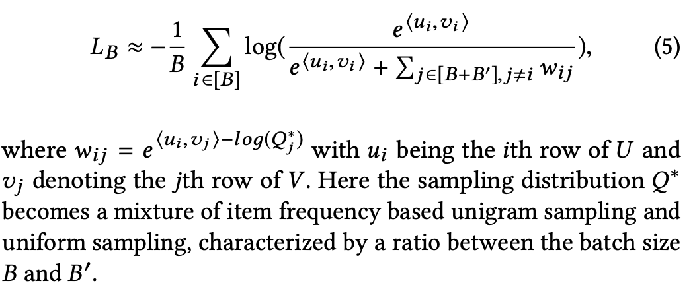
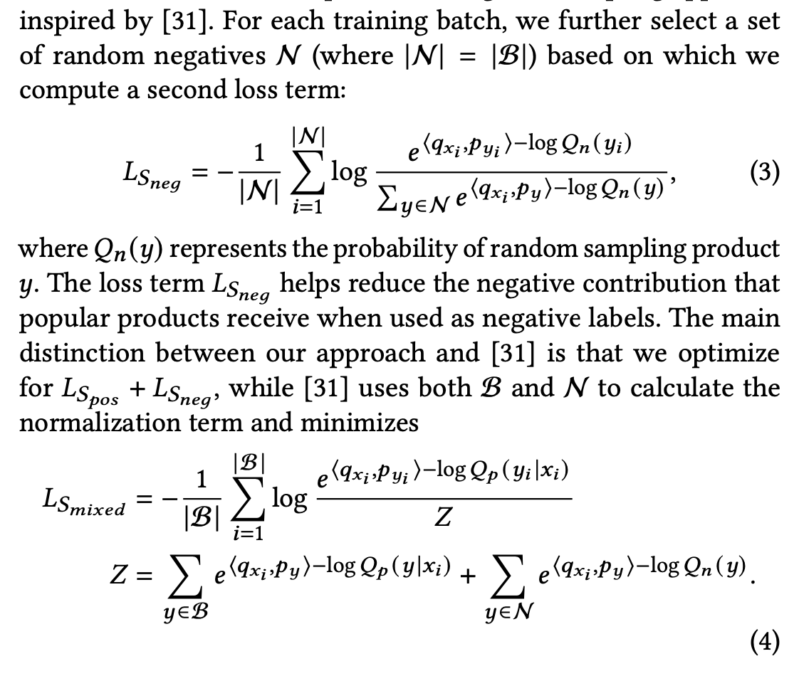
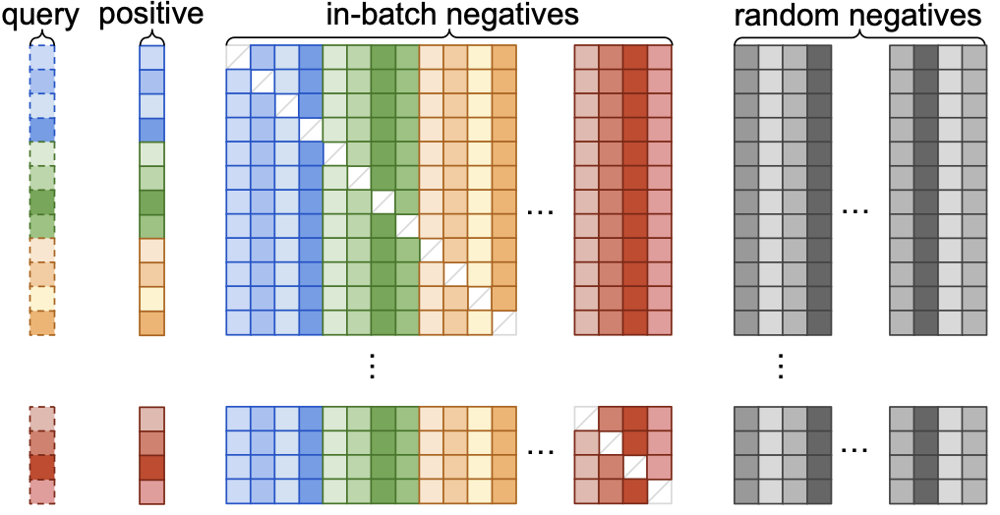

In our previous posts, we walked through the sampled softmax and in-batch negatives as loss functions for training a retrieval model. In this post, we will explore the best of both worlds in the so-called mixed negative sampling. This method will prove the be the most data efficient and yield the best performance of the previous two methods. The post contains a new implementation of all three methods which will allow all three to be trained from (approximately) the same data loader and compared.

# Motivation

We will assume familiarity with the previous posts, as this post continues to build on the foundation and code from before. To remind the reader, we are aiming to train a two-tower model from a dataset of user history and positive (watched/clicked/etc.) examples. A naive way to train this model would be to train a full softmax over all classes, but the number of classes could be in the billions. Instead, one may use the sampled softmax loss to approximate the full softmax. There's another approach (in-batch negatives) where one uses the items in the batch itself as the negatives, but this unfairly penalizes popular items and moreover can miss extremely unpopular items, leading to surfacing them by accident from the retrieval step. To combine the best of both worlds at the same computational complexity, the next logical approach is to combine the two into a single loss. This loss looks like the previous two losses, except the denominator now sums over negatives from the batch and the randomly sampled negatives. 

The [Mixed Negatives paper](https://storage.googleapis.com/gweb-research2023-media/pubtools/6090.pdf) uses a mixture of the probabilities from the unigram sampling of in-batch negatives and the uniform distribution, given by the formula




# Estimating LogQ for the combined distribution

As there is not really any additional math to explore, the only open question is to derive the estimate for the $$\text{log}Q^*$$ term. This time there's disagreement among different parties as to which is the right way to do this. In fact, there's still open [issues](https://github.com/tensorflow/recommenders/issues/635) on the official TensorFlow repository around how to calculate this term as the original paper left this vague.

As we have two possible ways to sample an item (in-batch negative or random sample), my take is that the final probability for their $$Q^*$$ must be the overall probability an item appears in the batch from either of these sampling approaches. To calculate this, you can combine the two possibilities. As usual, we will calculate the probability the item will not appear in the batch and then take the complement. 

Define $$\eta$$ to be the probability the item appears as a positive example and $$\gamma$$ as it's uniform random probability. Then for a batch size of $$B$$ and $$B^\prime$$ random negatives, the probability you do not sample the item via in-batch items is $$(1-\eta)^B$$ and similarly for your random negatives it is $$(1-\gamma)^{B^\prime}$$. As these two samples are made independently, your total probability to not sample the item is $$(1-\eta)^B(1-\gamma)^{B^\prime}$$. Thus, the probability to not sample the item in the batch is $$1-(1-\eta)^B(1-\gamma)^{B^\prime}.$$

Like in the previous post, from the formula one can see that they again define $$\text{log}(Q^*)=1$$ for items in the batch when on their respective row. This will be clear in the implementation as we fill the diagonal of our log probability matrix with zeros.

With that said, [Pinterest](https://arxiv.org/pdf/2205.11728) on the other hand uses a positive and negative loss term, where the negative term only contains the random negatives. In this case, they calculate the probability as a simple $$1/\vert X\vert$$ where $$X$$ is the item set:



as they define $$\text{log}Q(y\vert x)$$ as the probability of $$y$$ being included as a positive sample in the batch and $$\text{log}Q(y)$$ as the probability of sampling the product $$y$$ (not mentioning the batch, represented by $$x$$, at all). As $$\text{log}Q(y):=\alpha$$ is a constant, it would cancel out of the loss term $$L_{S_{Neg}}$$, equation (3) in the image above:

$$
\begin{align}
L_{S_{Neg}} &= -\frac{1}{\vert N\vert }\sum_{i=1}^{\vert N\vert } \frac{ e^{\langle q_{x_i}, q_{y_i} \rangle - \text{log}Q(y_i)}}{\sum_{y\in N} e^{\langle q_{x_i}, q_{y} \rangle - \text{log}Q(y)}}\\
&=-\frac{1}{\vert N\vert }\sum_{i=1}^{\vert N\vert } \frac{ e^{\langle q_{x_i}, q_{y_i} \rangle - \alpha}}{\sum_{y\in N} e^{\langle q_{x_i}, q_{y} \rangle - \alpha}}\\
&=-\frac{1}{\vert N\vert }\sum_{i=1}^{\vert N\vert } \frac{ e^{\langle q_{x_i}, q_{y_i} \rangle}e^{- \alpha}}{\sum_{y\in N} e^{\langle q_{x_i}, q_{y} \rangle}e^{- \alpha}}\\
&=-\frac{1}{\vert N\vert }\sum_{i=1}^{\vert N\vert } \frac{ e^{\langle q_{x_i}, q_{y_i} \rangle}}{\sum_{y\in N} e^{\langle q_{x_i}, q_{y} \rangle}}
\end{align}
$$

Moreover, they claim this improves the overall performance, but how could that be if the term drops out? Notice this term now a sampled softmax term for their objective function, which is probably why it is effective. In the Mixed Negative sampling paper, their denominator does not actually use $$\text{log}Q(y\vert x)$$ or $$\text{log}Q(y)$$ as written in (4) above, but it actually uses a new distribution $$\text{log}Q^*(y\vert x)$$ where $$Q^*$$ is the "mixture" of the two distributions. The probability theoretically was explained in a previous paragraph.


### Sampling Once Per Batch

In case it wasn't apparent from the formula, the random negatives are sampled once per batch. Not only is reusing the items computationally more efficient, but it's convenient as well. See this image from [Pinterest](https://arxiv.org/pdf/2205.11728) on how to visualize the examples in a batch-- the negative samples are in grey:



In my previous post on the sampled softmax, I lazily just sampled for every row, which is more computationaly expensive and unnecessary.

## Practical Considerations 

### Evaluation

This time, we are going to go with a more typical and robust valiation metric, Recall @ K. For this, we take the model and apply it to all the item in our universe. From there, we take the Top K items and see if the item clicked in the positives set was found in the Top K. This will allow us to more clearly show the benefits of including softmax and inbatch negatives.

To compare, we do a quick re-implementation of the previous two blog posts, with slight enhancements, to allow us to do a comparison. Interestingly enough, in the [TensorFlow sampling guide](https://www.tensorflow.org/extras/candidate_sampling.pdf), they include the LogQ correction on their sampled softmax to include the possibility of other sampling methods rather than just uniform sampling.

### Productionizing

In the code below, I basically output the "user" and "item" tower embeddings from a single model and use that in my loss function. If I were to do this for production, the code here would serve more as my training harness. In my code, I trivial reuse the item embeddings as the item tower-- a valid but simple approach. In reality, I'd define a user and item tower and then combine them during training like you see below. Then for production I'd save each model separately, using the user tower at runtime (or precomputed + stored in a cache) and the item tower would be used during data processing and stored in a vector database.

## PyTorch Code

```python
import torch
import torch.nn as nn
import torch.nn.functional as F
from torch.utils.data import Dataset
import hashlib
import pandas as pd
import numpy as np

```


```python
EMBED_TABLE_SIZE = 1000
hash_f = lambda x: int(hashlib.md5(x.encode('utf-8')).hexdigest(),16) % EMBED_TABLE_SIZE
```


```python
mps_device = torch.device("mps")
```


```python
d = pd.read_csv('data/ratings.csv')
```


```python
n_movies = d.movieId.nunique()
all_movies = d.movieId.unique().tolist()
n_movies
```


    83239


```python
max_pad=30
```


```python
d['click'] = d['rating'] >= 3
dd = d[d['click'] > 0].groupby('userId', as_index=False).movieId.apply(list) # assumes final list is in order
dd.set_index('userId',inplace=True)
dd=dd[dd.movieId.apply(len) > max_pad+2] # minimum number of movies per user
```


```python
# get movies list
movies = pd.read_csv('data/ml-latest-small/movies.csv')
movies.set_index('movieId',inplace=True)
```


```python
class MovieLensInBatchDataset(Dataset):
    def __init__(self, user_level_data, random_negatives=999):
        self.d = user_level_data
    
    def __len__(self):
        return len(self.d)

    def __getitem__(self, idx):
        user_movies = dd.iloc[idx]['movieId']
        label_idx = np.random.choice(range(1,len(user_movies)))
        history = user_movies[label_idx-max_pad:label_idx]
        label_movie_id = user_movies[label_idx]
        return history, [label_movie_id]
```


```python
from typing import Any, Iterable

import torch
from torch import Tensor, nn

from sentence_transformers import util
from sentence_transformers.SentenceTransformer import SentenceTransformer

class MixedNegativesRankingLossLogQ(nn.Module):
    
    def __init__(self, scale: float = 20.0, similarity_fct=util.cos_sim, device='cpu') -> None:
        super().__init__()
        self.scale = scale
        self.similarity_fct = similarity_fct
        self.cross_entropy_loss = nn.CrossEntropyLoss()
        self.device = device

    def forward(self, output: Tensor, log_candidate_probabilities: list, random_scores: Tensor, log_sample_prob: list) -> Tensor:
        reps = output
        embeddings_a = reps[0]
        embeddings_b = reps[1] # labels already concatenated due to model design

        log_probabilities_tensor = torch.as_tensor(log_candidate_probabilities).reshape(1, -1).repeat(embeddings_a.size(0), 1).to(self.device)
        # need to set the correction for the positive label to 0
        log_probabilities_tensor.fill_diagonal_(0)
        
        scores = self.similarity_fct(embeddings_a, embeddings_b) * self.scale
        range_labels = torch.arange(0, scores.size(0), device=scores.device)

        logq_corr_scores = scores-log_probabilities_tensor

        random_a = random_scores[0]
        random_b = random_scores[1].squeeze(0)
        log_probabilities_rand_tensor = torch.as_tensor(log_sample_prob).reshape(1, -1).repeat(random_a.size(0), 1).to(self.device)

        random_scores_sim = self.similarity_fct(random_a, random_b) * self.scale - log_probabilities_rand_tensor # same logQ for all items
        
        final_scores_with_randoms = torch.cat((logq_corr_scores, random_scores_sim), dim=1)
        
        return self.cross_entropy_loss(final_scores_with_randoms, range_labels) #log Q correction

    def get_config_dict(self) -> dict[str, Any]:
        return {"scale": self.scale, "similarity_fct": self.similarity_fct.__name__}

```

```python
import copy
class DeepNetRecommender(nn.Module):
    def __init__(self, n_embed=3, table_size=EMBED_TABLE_SIZE, embed_dim=64):
        super(DeepNetRecommender, self).__init__()
        # MUST DEFINE ALL LAYERS IN THE BODY OR PYTORCH DOESNT NOTICE THEM
        self.embed1 = nn.Embedding(table_size, embed_dim)
        self.embed2 = nn.Embedding(table_size, embed_dim)
        self.embed3 = nn.Embedding(table_size, embed_dim)
        # need to set seed for it to be the same
        np.random.seed(182)
        self.embeds = [(getattr(self,'embed'+str(k)),np.random.choice(100000)) for k in range(1,1+n_embed)] # (layer, salt)

        self.model = nn.Sequential(nn.Linear(64,64), nn.ReLU(), nn.Linear(64,64), nn.ReLU(), nn.Linear(64,64)) 
        
    def embed(self, x, max_pad, default=False):
        o = None
        x = copy.deepcopy(x) # since we edit it
        # Append a default to x, stops NAN
        if default:
            x.insert(0, 'DEFAULT')
        for embedder, salt in self.embeds:
            items = [hash_f(str(salt) + '_' + str(k)) for k in x][:max_pad]
            hashed_items = torch.IntTensor(items).to(mps_device)
            embedded = embedder(hashed_items)
            if o is None:
                o = embedded
            else:
                o += embedded
        return o
    
    def embed_stack(self, x):
        return torch.stack([self.embed(k, max_pad=len(k)) for k in x],0)

    def _embed_transform(self, y, max_pad):
        # embeds variable length inputs and translate them to the same size, [1,64] via averaging
        x = self.embed(y, max_pad, default=True)
        return torch.sum(x,0) / x.shape[0]
        
    def embed_and_avg(self, data, max_pad):
        stacked = torch.stack([self._embed_transform(x, max_pad) for x in data],0)
        return stacked.unsqueeze(1)
        
    def forward(self, x):
        # Pad, stack and embed vectors
        inps = x['history']
        to_rank = x['to_rank']

        lhs = self.embed_and_avg(inps, max_pad)
        lhs = self.model(lhs)
        
        rhs = self.embed_stack(to_rank)

        return lhs.squeeze(1), rhs.squeeze(1)

```


```python
dd['train'] = np.random.uniform(0,1, len(dd)) < .9
                                
dataset=MovieLensInBatchDataset(dd[dd['train']])
val_dataset=MovieLensInBatchDataset(dd[~dd['train']])

def my_collate(batch):
    data = [item[0] for item in batch]
    target = [item[1] for item in batch]
    return [data, target]
    
trainloader = torch.utils.data.DataLoader(dataset, batch_size=256, drop_last=True,
                                        shuffle=True, collate_fn = my_collate)
testloader = torch.utils.data.DataLoader(val_dataset, batch_size=256, drop_last=True,
                                        shuffle=True, collate_fn = my_collate)
```


```python
# run through the training set to estimate probabilities
prob_counter = {}
counter = 0
for i, data in enumerate(trainloader):
    _, labels = data
    for item in labels:
        counter += 1
        it = item[0] # always has 1
        prob_counter[it] = prob_counter.get(it, 0) + 1
        
```


```python
def get_prob(movie_id):
    return prob_counter.get(movie_id,0)/counter

ALL_ITEMS = set(prob_counter.keys())
```


```python
RANDOM_NEGATIVES = 256

def make_log_probability_for_item(item_id, batch_size, add_uniform):
    in_batch_probability = get_prob(item_id)
    if add_uniform: 
        uniform_probability = 1.0 / (len(ALL_ITEMS) - batch_size) # remove the options that can't be selected
    else:
        uniform_probability = 0 # it'll dropout from the equations below

    prob_not_appear_in_batch_as_neg = (1-in_batch_probability)**batch_size
    prob_not_appear_in_batch_as_rand = (1-uniform_probability)**RANDOM_NEGATIVES

    prob_appear_in_batch = 1 - prob_not_appear_in_batch_as_neg*prob_not_appear_in_batch_as_rand
    return np.log(prob_appear_in_batch + 1e-6).astype(np.float32)
    
# This function will allow us to do all 3 loss functions, details in the appendix
def inbatch_collate(batch, add_uniform=True):
    data = [item[0] for item in batch]
    target = [item[1] for item in batch]
    log_candidate_probabilities = [make_log_probability_for_item(item[0],len(batch),add_uniform) for item in target] # must be float for torch
   
    # only keep non duplicates
    target_set = set()
    data_new = []
    target_new = []
    log_probs_new = []
    for k in range(len(data)):
        candidate  = target[k][0]
        if candidate not in target_set:
            target_set.add(candidate)
        data_new.append(data[k])
        target_new.append(target[k])
        log_probs_new.append(log_candidate_probabilities[k])
    
    # sample random negatives for the batch (same items the whole batch)
    available_negatives = list(ALL_ITEMS - target_set)
    random_sample = np.random.choice(available_negatives, replace=True, size=RANDOM_NEGATIVES).tolist() # ez sampling
    sample_candidate_prob = [make_log_probability_for_item(ritem, len(batch), add_uniform) for ritem in random_sample] # same for every item

    return [data_new, target_new, log_probs_new, random_sample, sample_candidate_prob]
    
```


```python
from torch.utils.tensorboard import SummaryWriter

# default `log_dir` is "runs" - we'll be more specific here
writer = SummaryWriter('runs/experiment_1')
```


```python
trainloader = torch.utils.data.DataLoader(dataset, batch_size=256, drop_last=True,
                                        shuffle=True, collate_fn = inbatch_collate)


def train_one_epoch(model, epoch_index, tb_writer, loss_fn, optimizer, training_data):
    running_loss = 0.
    last_loss = 0.

    for i, data in enumerate(training_data):
        inputs, labels, log_candidate_probabilities, random_samples, sample_candidate_prob = data
        batch_size = len(inputs)
        optimizer.zero_grad()

        # Make predictions for this batch
        outputs = model({'history': inputs, 'to_rank':labels})

        random_outputs = model({'history': inputs, 'to_rank': [random_samples]})

        # Compute the loss and its gradients
        loss = loss_fn.forward(outputs, log_candidate_probabilities, random_outputs, sample_candidate_prob)
        loss.backward()
        
        # Adjust learning weights
        optimizer.step()

        # Gather data and report
        l = loss.item()
        
        running_loss += l
        if i % 100 == 99:
            last_loss = running_loss / 100 # loss per batch
            print('  batch {} loss: {}'.format(i + 1, last_loss))
            tb_x = epoch_index * len(training_data) + i + 1
            tb_writer.add_scalar('Loss/train', last_loss, tb_x)
            running_loss = 0.

    return last_loss

def topk(user, movie_embeddings, label):
    o = torch.topk((torch.nn.functional.normalize(user, dim=0) @ torch.nn.functional.normalize(movie_embeddings.squeeze(0)).T) * 1/.05,k=100)
    return label in o.indices.detach().cpu().tolist()

def recall_at_k(model, validation_set):
    scores = []
    all_movies = model({'history': [[]], 'to_rank': [list(movies.index)]})[1]
    for i, vdata in enumerate(validation_set):
        # Do a normal categorical cross entropy here
        vinputs, vlabels = vdata
        toutputs = model({'history': vinputs, 'to_rank':vlabels})
        for k in range(toutputs[0].shape[0]):
            scores.append(topk(toutputs[0][k], all_movies, vlabels[k][0]))
    return sum(scores) / len(scores)
```

### Training and Evaluation


```python
fixed_validation_set = [vdata for vdata in testloader]

# Note, the implementation of the other losses and training data can be found in the appendix
models_list = [
    (DeepNetRecommender().to(mps_device), SampledSoftmaxLoss(device=mps_device), trainloader),
    (DeepNetRecommender().to(mps_device), InBatchNegativesRankingLossLogQ(device=mps_device), trainloader_inbatch),
    (DeepNetRecommender().to(mps_device), MixedNegativesRankingLossLogQ(device=mps_device), trainloader)
]

for model,loss_fn, data in models_list:
    print(loss_fn.__class__.__name__)
    fixed_validation_set = [vdata for vdata in testloader]
    val_loss =  nn.CrossEntropyLoss()
    epochs = 1
    avg_loss = -1
    recallk = -1
    optimizer = torch.optim.Adam(model.parameters(), lr=0.01)

    for epoch_number in range(epochs+1):
        if epoch_number > 0:
            model.train()
            avg_loss = train_one_epoch(model, 1, writer, loss_fn, optimizer, data)
            running_vloss = 0.0
            model.eval()
    
        with torch.no_grad():

            recallk = recall_at_k(model, fixed_validation_set)
    
        print('LOSS train {}, recall at K=100 {}'.format(avg_loss, recallk))
    
        writer.add_scalars('Training vs. Validation Loss',
                        { 'Training' : avg_loss, 'Recall @ K': recallk},
                        epoch_number + 1)
        writer.flush()

    torch.save(model, 'model.pt' +'_' +'_'.join([str(k[1]) for k in model.embeds]) +'.pt' ) # save model with hashes

```

    SampledSoftmaxLoss
    LOSS train -1, recall at K=100 0.008606991525423728
      batch 100 loss: 6.05161937713623
      batch 200 loss: 4.964744267463684
      batch 300 loss: 4.806023988723755
      batch 400 loss: 4.414644556045532
      batch 500 loss: 4.322190275192261
    LOSS train 4.322190275192261, recall at K=100 0.02734375

    InBatchNegativesRankingLossLogQ
    LOSS train -1, recall at K=100 0.0070842161016949155
      batch 100 loss: 15.866553812026977
      batch 200 loss: 14.125361070632934
      batch 300 loss: 13.545234756469727
      batch 400 loss: 13.384280347824097
      batch 500 loss: 13.012882032394408
    LOSS train 13.012882032394408, recall at K=100 0.019266419491525424

    MixedNegativesRankingLossLogQ
    LOSS train -1, recall at K=100 0.006554555084745763
      batch 100 loss: 9.424322414398194
      batch 200 loss: 8.256024441719056
      batch 300 loss: 7.895284662246704
      batch 400 loss: 7.619677515029907
      batch 500 loss: 7.377127647399902
    LOSS train 7.377127647399902, recall at K=100 0.036083156779661014


Note: this dataset is a bit contrived, which is why it's possible that the recall at K figure is relatively low. Regardless, you can see that mixed negative sampling yields the best performance.


```python
def map_movies_list(x):
    return [movies.loc[k,'title'] for k in x]
```


```python
# Score the mixed negative sampling model
o = models_list[-1][0]({'history': [dd.iloc[0].movieId[:max_pad]], 'to_rank': [list(movies.index)]})
```


```python
all_movies_scored = torch.nn.functional.normalize(o[0]) @ torch.nn.functional.normalize(o[1].squeeze(0)).T
```


```python
print('User Movies','\n', map_movies_list(dd.iloc[0].movieId[:max_pad]))
```

    User Movies 
     ['Toy Story (1995)', 'Braveheart (1995)', 'Casper (1995)', 'Star Wars: Episode IV - A New Hope (1977)', 'Forrest Gump (1994)', 'When a Man Loves a Woman (1994)', 'Pinocchio (1940)', 'Die Hard (1988)', 'Ghost and the Darkness, The (1996)', 'Shall We Dance (1937)', 'Star Wars: Episode V - The Empire Strikes Back (1980)', 'Aliens (1986)', 'Star Wars: Episode VI - Return of the Jedi (1983)', 'Alien (1979)', 'Indiana Jones and the Last Crusade (1989)', 'Star Trek IV: The Voyage Home (1986)', 'Sneakers (1992)', 'Shall We Dance? (Shall We Dansu?) (1996)', 'X-Files: Fight the Future, The (1998)', 'Out of Africa (1985)', 'Last Emperor, The (1987)', 'Saving Private Ryan (1998)', '101 Dalmatians (One Hundred and One Dalmatians) (1961)', 'Lord of the Rings, The (1978)', 'Elizabeth (1998)', 'Notting Hill (1999)', 'Sixth Sense, The (1999)', 'Christmas Story, A (1983)', "Boys Don't Cry (1999)", 'American Graffiti (1973)']


```python
print('Predicted Top 20 Movies', '\n', movies.title.values[np.argsort(all_movies_scored.cpu().detach().numpy())[0][::-1]][:20])
```

    Predicted Top 20 Movies 
     ['Gladiator (2000)' 'Fight Club (1999)' 'Memento (2000)'
     "Amelie (Fabuleux destin d'Amélie Poulain, Le) (2001)"
     'Lord of the Rings: The Fellowship of the Ring, The (2001)'
     'Predator (1987)' 'Green Mile, The (1999)' 'Requiem for a Dream (2000)'
     'Snatch (2000)' 'Crouching Tiger, Hidden Dragon (Wo hu cang long) (2000)'
     'Being John Malkovich (1999)' 'Cigarette Burns (2005)'
     'O Brother, Where Art Thou? (2000)' 'Meet the Parents (2000)'
     'X-Men (2000)' 'American Beauty (1999)' 'Shrek (2001)'
     'Who Framed Roger Rabbit? (1988)' 'Erin Brockovich (2000)'
     'Sixth Sense, The (1999)']


## Appendix


```python
# Define all 3 losses with the same inputs for comparisons!

class SampledSoftmaxLoss(nn.Module):
    
    def __init__(self, scale: float = 20.0, similarity_fct=util.cos_sim, device='cpu') -> None:
        super().__init__()
        self.scale = scale
        self.similarity_fct = similarity_fct
        self.cross_entropy_loss = nn.CrossEntropyLoss()
        self.device = device

    def forward(self, output: Tensor, log_candidate_probabilities: list, random_scores: Tensor, log_sample_prob: list) -> Tensor:
        reps = output
        embeddings_a = reps[0]
        embeddings_b = reps[1] # labels already concatenated due to model design

        scores = self.similarity_fct(embeddings_a, embeddings_b) * self.scale
        default_label = torch.zeros((embeddings_a.shape[0]), dtype=torch.long).to(mps_device)

        scores = torch.diag(scores,0).unsqueeze(1)

        random_a = random_scores[0]
        random_b = random_scores[1].squeeze(0)

        random_scores_sim = self.similarity_fct(random_a, random_b) * self.scale # same logQ for all items
        # Make first column the label
        final_scores_with_randoms = torch.cat((scores, random_scores_sim), dim=1)
        return self.cross_entropy_loss(final_scores_with_randoms, default_label) #log Q correction

class InBatchNegativesRankingLossLogQ(nn.Module):
    
    def __init__(self, scale: float = 20.0, similarity_fct=util.cos_sim, device='cpu') -> None:
        super().__init__()
        self.scale = scale
        self.similarity_fct = similarity_fct
        self.cross_entropy_loss = nn.CrossEntropyLoss()
        self.device = device

    def forward(self, output: Tensor, log_candidate_probabilities: list,  random_scores: Tensor, log_sample_prob: list) -> Tensor:
        reps = output
        embeddings_a = reps[0]
        embeddings_b = reps[1] # labels already concatenated due to model design

        log_probabilities_tensor = torch.as_tensor(log_candidate_probabilities).reshape(1, -1).repeat(embeddings_a.size(0), 1).to(self.device)
        # need to set the correction for the positive label to 0
        log_probabilities_tensor.fill_diagonal_(0)
        
        scores = self.similarity_fct(embeddings_a, embeddings_b) * self.scale
        logq_corr_scores = scores-log_probabilities_tensor
        
        scores = self.similarity_fct(embeddings_a, embeddings_b) * self.scale
        range_labels = torch.arange(0, scores.size(0), device=scores.device)
        
        return self.cross_entropy_loss(logq_corr_scores, range_labels) #log Q correction

    def get_config_dict(self) -> dict[str, Any]:
        return {"scale": self.scale, "similarity_fct": self.similarity_fct.__name__}

```


```python
trainloader_inbatch = torch.utils.data.DataLoader(dataset, batch_size=256, drop_last=True,
                                        shuffle=True, collate_fn = lambda x : inbatch_collate(x, add_uniform=False))

```
