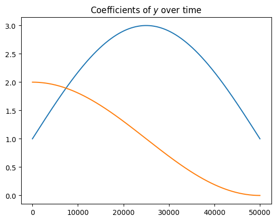
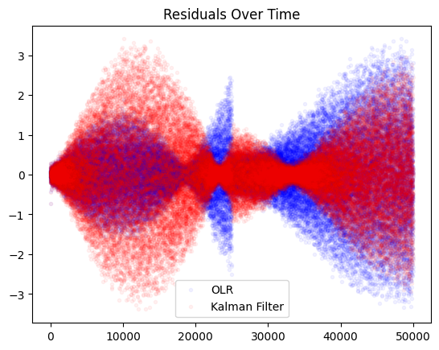
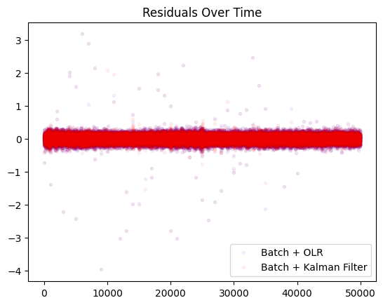

In this post, we explore two approaches for training a linear regression online and compare their behavior on non-stationary data. We begin by deriving online linear regression and the Kalman filter update from first principles. Then, we empirically show differences between the two methods by fitting models using each algorithm on non-stationary data and looking at the residuals. 


## Online Linear Regression

If you look at the least squares solution given IID data points $$(x_i,y_i)_{i=1}^{m}$$ with $$x_i\in\mathbb{R}^{k}$$ and $$y_i\in\mathbb{R}$$, then the usual solution is to write $$X \beta = Y$$ with  $$X\in \mathbb{R}^{mxk}$$ $$,\beta\in \mathbb{R}^{k}$$, and $$Y\in \mathbb{R}^{m}$$, then you get that $$\beta = (X^TX)^{-1}X^T Y$$. Of course, according to [Gauss-Markov](https://en.wikipedia.org/wiki/Gauss–Markov_theorem), this estimator is the "best linear unbiased estimator" to the minimization problem

$$\min_{\beta} \sum_{i=1}^n \| y_i - x_i^T \beta\|_2^2.$$

We will use the following facts to derive the variance estimate of $$\beta$$:
- Assuming $$y\sim \mathbf{N}(x^T \beta, \sigma^2)$$, then for a sample of size $$m$$ arranged as a vector, $$Y \sim \mathbf{N}( X\beta, \sigma^2 I_d)$$ (as each entry of $$Y$$ has the same distribution).
- For a matrix $$A$$ and vector $$v$$, $$\text{var}(Av) = A\text{var}(v)A^T$$
- For a symmetric matrix $$A$$, $$A^{-1}$$ is symmetric.
- $$X^TX$$ is symmetric.

Then, we have 

$$
\begin{align}
\text{var}(\beta)&=(X^TX)^{-1}X^T\text{var}(Y)X(X^{-1}X)^{-1}\\
&=\sigma^2(X^TX)^{-1}X^TI_d X(X^{-1}X)^{-1}\\
&=\sigma^2 (X^TX)^{-1}.
\end{align}$$

This can also be derived by assuming a prior and deriving a Bayesian update as in [here](https://arxiv.org/pdf/2305.07764). The solution will require collecting terms of the exponent and completing the matrix square. It is an annoying calculation.

We will derive an online update formula for the solution. There is an identity (see an intuitive proof [here](https://gregorygundersen.com/blog/2020/07/17/matmul/)) that says
$$X^TX = \sum_{i=1}^{m} x_i x_i^T$$
where $$x_i$$ is the i-th row of $$X$$. (Recall, the row's of $X$ correspond to a single training example.) Additionally, by definition, we have $$X^T Y=\sum_{i=1}^m x_i y_i$$. Now, we let 

$$\Sigma_t := \epsilon I_d + \sum_{i=1}^{t} x_i x_i^T$$

 with a small $$\epsilon$$ for stability, then the least squares solution means that our estimate for $$\beta$$ at time $$t$$ is given by

$$\beta_t := \Sigma_t^{-1}\left ( \sum_{i=1}^{t} x_i y_i \right ).$$

You can use these formulas to continuously update the model as new data comes in. Note, you could of course use stochastic gradient descent as well, but this formula will also give you the _estimated covariance of the model parameters_, which is neccesary for applications like Thompson Sampling. Note, you must also estimate $$\sigma^2$$ in order to derive the final covariance, which can also be done in an online manner.


### Implementation

To test our implementation (and the next implementation), we will generate data according to the formula

$$y \sim \mathbf{N}( 2x_1 + x_2, .1)$$

$$ x_1,x_2 \sim \mathbf{U}(-1,1)$$

and try to recover the coefficients via the algorithm by feeding the data in one example at a time.

```python
import numpy as np
n = 1000
X = np.random.uniform(-1,1,size=(n,2))
true_beta = np.array([[2],[1]])
sigma2 = .1
y = X @ true_beta + np.random.normal(0,scale=np.sqrt(sigma2),size=n).reshape((n,1))
```


```python
Sigma = np.eye(2)*.001
beta_sum = 0
for k in range(n):
    xk = X[k,:].reshape((2,1))
    yk = y[k][0]
    Sigma += xk @ xk.T
    beta_sum += xk*yk

beta_est = np.linalg.inv(Sigma) @ beta_sum
beta_est
```


    array([[2.04757379],
           [0.98071726]])


As you can see, we have recovered the true parameters, $$[2,1]^T$$, approximately.

## Kalman Filter

The Kalman filter is used to estimate an unknown state via a recursive formula for the current state from the previous state and updates its estimate from (noisy) observations. The Kalman filter takes into account noise from the measurement to help update the belief on the state. It's often used for tracking the location of objects via GPS, where given an objects state (say position and velocity) there are physics equations which give a strong estimate on where the object will end up. 

As viewed as an optimization problem, the Kalman Filter can be understood (as described [here](https://www.actuaries.asn.au/Library/Events/GIS/2012/GIS2012PaperSemenovichMMcLean.pdf)) as learning a collection of $$\beta_t$$ such that

$$\min_{\beta_t} \sum_{i=1}^n \| y_i - x_i^T \beta_i\|_2^2 + \sum_{i=1}^{n-1}\|\beta_{i+1} \beta_{i}\|_2^2$$

which implies there will be a slightly different solution to the OLR model.

An intuitive way to derive the Kalman Filter update is by starting at Bayes theorem. Unlike OLR above, the variance of the residuals of the estimate is explicitly found in the formula. Let $$D_t:= \{ (x_i,y_i) \}_{i \leq t}$$. From Bayes theorem, we can write
$$p(\beta | D_t) \propto p(y_t | \beta, D_{t-1}) p(\beta | D_{t-1}).$$

Following the notation of [the wiki](https://en.wikipedia.org/wiki/Kalman_filter), we can assume 
$$\beta| D_{t-1} \sim \mathbf{N}(\beta_{t-1}, P_{t-1})$$. Moreover, by assumption, $$y | D_{t-1} \sim \mathbf{N}(X^T \beta, \sigma^2 I_{id})$$, and so due to prsence of $\sigma$ in the formula, we immediately see that the variance of the residuals play an explicit role in the update formula, which was not the case in online linear regression. If we now look at the exponents (by taking the log), we can see 

$$\text{log} p(\beta | D_t) \propto (y_t - X_t^T \beta)^T (\sigma^2 I_{id})^{-1} (y_t - X_t^T \beta) + (\beta - \beta_{t-1})^T P_{t-1}^{-1} (\beta - \beta_{t-1}).$$

To find the update, you have to rearrange the terms to be of the form

$$(\beta - \beta_t)^T P_{t}^{-1} (\beta-\beta_t),$$

by dropping terms that don't depend on $$\beta$$ (the proportional operator $$\propto$$ allows you to ignore constants). When finished, you have the updates. This is easier said than done... one trick to doing this is to collect $$\beta$$ terms and complete the (matrix) square. Another approach, perhaps faster and hand-wavier, is to adjust the first term to be of the form above and then use a Gaussian mixture formula for the resulting distribution.

First, note that
$$
\begin{align}
(y_t - X_t^T \beta)^T (\sigma^2 I_{id})^{-1} (y_t - X_t^T \beta) &= \left [ X_t^T ( \alpha y_t - \beta) \right ]^T(\sigma^2 I_{id})^{-1} \left [ X_t^T ( \alpha y_t - \beta) \right ] \\
&= ( \beta-\alpha y_t)^T  \frac{1}{\sigma^2} X_t X_t^T  (\beta-\alpha y_t)
\end{align}
$$

where $$ X_t^T \alpha = I \Rightarrow  \alpha = (X_tX_t^T)^{-1} X_t $$. Now, if you use the formula for the product of Gaussian distributions (see section 8.1.8 [here](http://compbio.fmph.uniba.sk/vyuka/ml/old/2008/handouts/matrix-cookbook.pdf)), then the resulting distribution has variance

$$P_t = \left( \frac{1}{\sigma^2} X_t X_t^T + P_{t-1}^{-1} \right )^{-1}$$

and mean (after some cancelling of terms)

$$\beta_t = \left ( \frac{1}{\sigma^2} X_t X_t^T + P_{t-1}^{-1} \right )^{-1} \left( \frac{1}{\sigma^2} X_t y_t + P_{t-1}^{-1} \beta_{t-1}\right ).$$

One can then use the [Sherman-Morrison formula](https://en.wikipedia.org/wiki/Sherman–Morrison_formula) to derive the standard form of the update with $$A=P_{t-1}^{-1}$$:

$$P_t = \left( \frac{1}{\sigma^2} X_t X_t^T + P_{t-1}^{-1} \right )^{-1} = \left(I - \frac{P_{t-1}X_tX_t^T}{\sigma^2 I + X_t^T P_{t-1} X}\ \right ) P_{t-1}:=(I-KX_t^T)P_{t-1}$$

which is equivalent to the $$P_t$$ update given by the Kalman filter with $$K$$ as defined on the wiki article. For $$\beta_t$$, we have to factor out the residual by adding and subtracting appropriate terms
$$
\begin{align}
\beta_t &= P_{t}(P_{t-1}^{-1} \beta_{t-1} + \frac{1}{\sigma^2} X_t y_t) 
= P_{t}\left ( P_{t-1}^{-1} \beta_{t-1} + \frac{X_t}{\sigma^2} (y_t - X_t^T \beta_{t-1}) + \frac{1}{\sigma^2} X_t X_t^T\beta_{t-1}\right) \\
&= P_t \left [ P_{t}^{-1} \beta_{t-1} +  \frac{X_t}{\sigma^2} (y_t - X_t^T \beta_{t-1}) \right ]
= \beta_{t-1} + \frac{1}{\sigma^2} P_t X_t (y_t - X_t^T \beta_{t-1}).
\end{align} 
$$

Using the formula for $$P_t$$ from above, you can show that $$K=\frac{1}{\sigma^2}P_tX_t$$, which completes the equivalence demonstration of the formulas.

### Implementation


I used [this implementation](https://github.com/cantaro86/Financial-Models-Numerical-Methods/blob/master/5.1%20Linear%20regression%20-%20Kalman%20filter.ipynb) as a reference for a standard Kalman filter and extended it for the use case under consideration (no pun intended).


```python
import numpy as np
class KalmanFilter:

    def __init__(self, dim=2, var_n=100):
        
        self.x = np.array([[0], [0]])  # initial weights guess CTR ~ 1
        self.P = 0.1 * np.eye(dim)  # initial covariance, a guess
        self.Q = np.zeros((dim,dim)) # Who cares
        self.F = np.eye(dim)  # transition matrix

        # online covariance estimation terms
        self.meanr = self.C = self.n = 0
        self.res = [0]*var_n
        self.var_n = var_n

    def predict(self, xj, **kwargs):
        return xj @ self.x
    
    def update(self,xj,yj):
        
        # Extended Kalman Filter H, derivative of tmp_H w.r.t. the weights x
        H =  xj
    
        # predict
        self.x = self.F @ self.x
        self.P = (self.F @ self.P @ self.F.T) + self.Q
    
        # update
        if self.n > 2:
            R = np.var(self.res)
        else:
            R = .001
        S = (H @ self.P @ H.T) + R # S is scalar
        K = (self.P @ H.T) / S
        r = yj - H @ self.x   # residuals
        self.x = self.x + K @ r  # updated mean estimate
        self.P = self.P - K @ H @ self.P # updates covariance estimate

        # online covariance of the residuals
        self.res[(self.n-1) % self.var_n] = r[0][0]
        self.n += 1
        
        return r, self.x

```


```python
kf = KalmanFilter()
beta_sum = 0
for k in range(n):
    xk = X[k,:].reshape((1,2))
    yk = y[k][0]
    kf.update(xk,yk)

```


```python
kf.x
```


    array([[2.13008297],
           [0.97140339]])


## When to use the Kalman Filter?

The Kalman filter should be beneficial when the distibution is non-stationary. Although OLR does compute its solution iteratively, it does expect a fixed distribution. To alleviate this issue in practice, frequent retraining or continual batch updates (c.f., [here](https://arxiv.org/pdf/2305.07764) or [here](https://papers.nips.cc/paper_files/paper/2011/file/e53a0a2978c28872a4505bdb51db06dc-Paper.pdf)) are used. 

When distributions are non-stationary, the Kalman filter can explicitly (through the "Kalman gain" term $$K$$) weight the new observation of the old weights higher in the final formula. In this next experiment, we will compare the learned weights on a moving distribution.

For the test of $$n$$ rounds, we will distribute the data via 

$$y_t \sim \mathbf{N} \left ( 2 \text{sin}\left (\frac{\pi t}{n}\right ) x_1 + \text{cos}\left (\frac{\pi t}{n}\right )x_2, .1^2\right )$$

$$ x_1,x_2 \sim \mathbf{U}(-1,1)$$

You may noticed we changed the variance from the previous example.


```python
import numpy as np
n = 50000
X = np.random.uniform(-1,1,size=(n,2))
true_beta = np.array([[2],[1]])
sigma2 = .1**2
time_beta=1+np.tile(true_beta.T, reps=(n,1)) * np.column_stack([np.sin(np.pi*np.arange(n)/n).T, np.cos(np.pi*(np.arange(n)/n)).T])
# variance changing in time
time_beta = time_beta.T
var_term = [sigma2]*n
error_term = np.array([ np.random.normal(0,scale=np.sqrt(var_term[k])) for k in range(n)]).reshape((n,1))
y = np.matmul(X.reshape((n,1,2)), time_beta.reshape((n,2,1))).reshape((n,1)) + error_term
```

<!-- 
```python
plt.plot(time_beta[0,:])
plt.plot(time_beta[1,:])
plt.title('Coefficients of $$y$$ over time')
```
 -->

    

    


```python
# LR error:
Sigma = np.eye(2)*.001
beta_sum = np.zeros((2,1))
residuals = []
for k in range(n):
    # predict and get errors
    xk = X[k,:].reshape((2,1))
    yk = y[k][0]

    beta_est = np.linalg.inv(Sigma) @ beta_sum
    residuals.append((yk - xk.T @ beta_est)[0][0])

    # Accumulate
    Sigma += xk @ xk.T # annoyingly the outer product 
    beta_sum += xk*yk

beta_est = np.linalg.inv(Sigma) @ beta_sum
beta_est
```
<!-- 


    array([[1.63744966],
           [1.63181064]])

 -->


```python
# LR error:
residuals3 = []
beta_sum = np.zeros((2,1))

for k in range(n):
    # predict and get errors        
    xk = X[k,:].reshape((2,1))
    yk = y[k][0]

    beta_est = np.linalg.inv(Sigma) @ beta_sum
    residuals3.append((yk - xk.T @ beta_est)[0][0])

    # Accumulate
    Sigma += xk @ xk.T
    beta_sum += xk*yk

beta_est = np.linalg.inv(Sigma) @ beta_sum
beta_est
```

<!-- 


    array([[0.81872485],
           [0.81590534]])


 -->

```python
residuals2=[]
kf = KalmanFilter()
for k in range(n):
    # predict and get errors
    xk = X[k,:].reshape((1,2))
    yk = y[k][0]

    yp = kf.predict(xk)
    residuals2.append((yk - yp)[0][0])

    # Accumulate
    kf.update(xk,yk)

```
<!-- 

```python
import matplotlib.pyplot as plt
plt.plot(residuals,'b.', alpha=.05)
plt.plot(residuals2,'r.', alpha=.05)
plt.title('Residuals Over Time')
plt.legend(['OLR', 'Kalman Filter'])
```

 -->


    

    


```python
# MSE, last 5k step
np.mean(np.array(residuals[-5000:])**2), np.mean(np.array(residuals2[-5000:])**2)
```


    (1.83595273951509, 1.2811797655774746)


Where the Kalman Filter MSE on the right is clearly lower at the end of the experimental time period.

## Impact of Retraining

When drift becomes too large, it may make sense to retrain in batch instead of hoping for the model to adapt over time. When we institute this process, we see limited difference between the two methods.


```python
# LR error:
residuals3 = []
beta_sum = np.zeros((2,1))

for k in range(n):
    # predict and get errors
    # pretend batch
    if k % 1000 == 0:
        Sigma = np.eye(2)*.001 # reset!
        beta_sum = np.zeros((2,1))
        
    xk = X[k,:].reshape((2,1))
    yk = y[k][0]

    beta_est = np.linalg.inv(Sigma) @ beta_sum
    residuals3.append((yk - xk.T @ beta_est)[0][0])

    # Accumulate
    Sigma += xk @ xk.T 
    beta_sum += xk*yk

beta_est = np.linalg.inv(Sigma) @ beta_sum
beta_est
```


    array([[0.0020949 ],
           [0.00559066]])


```python
residuals4=[]
kf = KalmanFilter()
for k in range(n):
    # predict and get errors
    if k % 1000 == 0:
        kf = KalmanFilter()
    xk = X[k,:].reshape((1,2))
    yk = y[k][0]

    yp = kf.predict(xk)
    residuals4.append((yk - yp)[0][0])

    # Accumulate
    kf.update(xk,yk)

```


<!-- ```python
import matplotlib.pyplot as plt
plt.plot(residuals3,'b.', alpha=.05)
plt.plot(residuals4,'r.', alpha=.05)
plt.title('Residuals Over Time')
plt.legend(['Batch + OLR', 'Batch + Kalman Filter'])
```


    <matplotlib.legend.Legend at 0x31103f650>

 -->


    

    


```python
np.mean(np.array(residuals3)**2), np.mean(np.array(residuals4)**2)
```


    (0.014786805657152548, 0.015374404302767984)


From this, we can see that if you have the capability to retrain on a smaller time scale, for this very linear toy problem, it's better to retrain more often from scratch vs. online learning for highly non-stationary dynamics. For pure online learning, there are cases where Kalman filters can be helpful as seen in this example. In more stationary dynamics, you do not get a striking difference between the two methods.
