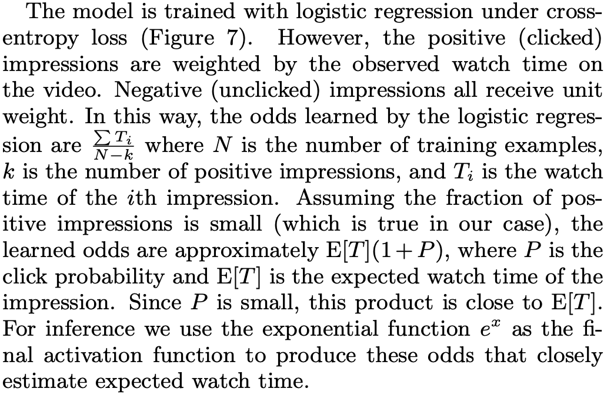
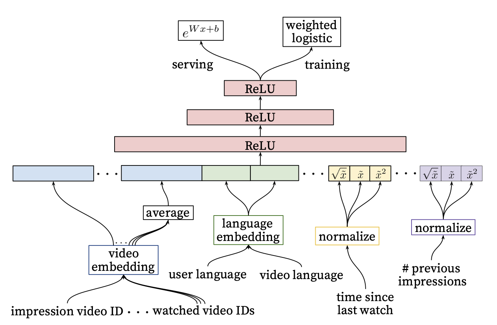

In reading the [YouTube Paper](https://static.googleusercontent.com/media/research.google.com/en//pubs/archive/45530.pdf), I came across one technical section that seemed very subtle and was not readily apparent why it was true: the watch time estimation using weighted logistic regression. It's easy to gloss over this detail, but as it turns out, [many](http://bourneli.github.io/recommendation/2020/07/19/notes-of-youtube-recommendation-2016.html) [people](https://zhuanlan.zhihu.com/p/61827629) [before](https://arxiv.org/pdf/2206.06003) me were curious about this section as well.  The previous links have already explored one view into the why behind this formula, but I would like to formalize the process and explain it end to end.

### Derivation

In the paper, they design the weights for their logistic regression training to be

$$w(x,y) = \left \{ \begin{array}{ll}\text{watch time}& \text{when } y=1\\1& \text{when } y=0, \end{array}   \right.$$

and they posit that this transforms the odds to be of the form

$$ \text{odds} = \mathbb{E}(\text{watch time}).$$

This was surprising to me, and so I wanted to dig in further. In the paper, they look at the overall odds and here is what they say:


I was initially confused at their starting point, but as their weights are uneven it eventually makes sense if you start from writing the new odds given the reweighted data. Here are a few more details that may help: Let's assume we set the weight as defined above. If there are $$k$$ positive examples and $$N$$ total, then the new probability $$q$$ (respecting the weights) of the positive class is  $$\sum_{x} \frac{w_x}{\sum_{x^\prime} w_{x^\prime} + (N-k)}:= \frac{w}{w+N-k}$$ and the negative class' probability is $$\frac{N-k}{w+N-k}$$. Then, we can write

$$\text{New Odds} = \frac{q(y=1)}{q(y=0)} = \frac{\frac{w}{w+N-k}}{\frac{N-k}{w+N-k}}$$ 

which is equivalent to their starting place if you cancel the denominators. Continuing by cancelling and pulling an $$N$$ from the denominator:

$$\text{New Odds} = \frac{w}{N} \frac{1}{1 - \frac{k}{N}}$$

which as $$k<<N$$, we can use the Taylor exansion of $$1/(1-x) = \sum_{i=0}^\infty x^i$$ to get

$$\text{New Odds} = \frac{w}{N} \left ( 1 + p_{ctr} +\dots \right ),$$

which when $$p_{ctr}$$, the click-through rate on the positive class, is small, we have 

$$\text{New Odds} \approx \frac{w}{N} = \mathbb{E}(\text{watch time}).$$


### A More Formal Proof

Although the above argument makes sense to motivate the approach, this argument does not imply what happens to the individual predictions. It is illuminating if we start from first principles and see why the weighted logistic regression training process will create this outcome. First, they take the dataset $$D=\{ (x,y) \}$$ and create a new distribution by introducing sampling weights. In particular, they are changing the probability distribution of training to follow a new one we will denote $$q$$. They define

$$q(x,y) = \frac{w(x,y) p(x,y)}{Z}.$$

I omit the normalization term from here on as it will cancel out. Let's quickly play around with this definition to understand how to calculate things with it. Notice that

$$q(y=1 | x) = \frac{q( x, 1)}{q(x)}= \frac{ w(x,1) p(x,1) }{q(x,1) + q(x,0)},$$

where the denominator comes from the definition of $$q(x)$$ and that $$y$$ takes on discrete values.

With this definition, we can see that the loss function $$\ell(x,y)$$ for training has a different expectation under $$q$$:

$$\mathbb{E}_q( \ell ) = \sum_{x,y} \ell(x,y)q(x,y) = \sum_{x,y} w(x,y) \ell(x,y) p(x,y) = \mathbb{E}_p(w \ell)$$

where the normalization constant can be dropped/ignored as it will carry through the formulas as a constant and won't impact training due to the learning rate choice. (Why? As the constant multiplies to all terms of the loss, it will also be a multiplicative factor against the gradient, which is multiplied by the learning rate and thus can be absorbed into the learning rate term.) So, if we weight each example in the loss function by $$w(x,y)$$ then we will optimize the loss based on the $$q$$ distribution.

Let's look at what this weighting does to the individual prediction level. Since logistic regression learns the log-odds for each data point, we can see the impact of learning this new distribution:

$$ \frac{q(y=1 | x)}{q(y=0|x)}=\frac{ \frac{ w(x,1) p(x,1) }{q(x,1) + q(x,0)}}{\frac{ w(x,0) p(x,0) }{q(x,1) + q(x,0)}} = \frac{ w(x,1) p(x,1) }{p(x,0)}.$$

by definition. Next, we can multiply this equation by $$1=p(x)/p(x)$$ to yield

$$ \frac{q(y=1 | x)}{q(y=0|x)} = \frac{ w(x,1) p(y=1|x) }{p(y=0|x)}$$

which shows the model tries to learn the log (odds multiplied by the watch time). 
By definition, we learn a model which predicts approximately the **expected watch time per a specific user** (Pay attention! This will come back later!)

$$ \text{log}\left (\frac{ w(x,1) p(y=1|x) }{p(y=0|x)} \right ) = x^T \beta \Rightarrow e^{x^T\beta} = \frac{w(x,1)p(y=1|x) }{p(y=0|x)}\approx w(x,1)p(y=1|x).$$

Now, to connect this to the original argument, notice that since $$w(x,0)=1$$,

$$ \frac{q(y=1)}{q(y=0)} =
\frac{ \sum_{x}w(x,1) p(x,1) }{ \sum_x w(x,0) p(x,0)}
=\frac{ \sum_x w(x,1) p(y=1|x)p(x) }{ p(y=0) }$$

by multiplying by $$1=p(x)/p(x)$$.
This next part is a little quirky but it works out. Since we are really looking at the sampled dataset $$D$$, $$p(x)\approx 1/N$$. Treating this as a constant we can pull this out and conclude that,
$$
\begin{align}
\sum_x w(x,1) p(y=1|x)p(x) &= \frac{1}{N}\sum_{\text{users}} (\text{expected watch time per user})\\ &= \frac{1}{N} \text{(Total watch time}) \\ &= \mathbb{E}(w).
\end{align}$$

It makes a bit more sense when you drop the formalism at the end, but now we can see how we get there clearly. If you do not assume $$p(x)$$ is uniform, then you get the quantity
$$E_{x\sim p}[ w(x,1) p(y=1|x)]:= \mathbb{E}(w)$$
which can also be understood as the expected watch time of a user (in other words, the expected watch time).


### Numerical Experiments

It would be difficult to simulate the YouTube example, but we can test it on a toy example. In a binary classification model, with a bias-only predictor, then the bias term should learn the average probability $$P$$ over the dataset. For instance, if $$p$$ is small, then 

$$\text{log}\left ( \frac{P}{1-P} \right ) = b \Rightarrow e^b \approx P.$$

In the same vein, if we follow the reweighting scheme above, then we would expect the exponential of the bias term to be equal to the expected watch time.


```python
import numpy as np
import statsmodels.api as sm
n=100000
y = np.random.binomial(1, .001, n) # note the small probability
weights = np.random.uniform(20, 100, n) # watch times!
weights[y==0] = 1 

print("Estimated watch time computed from training data:", np.sum(weights[y==1]) / n)

# Fit logistic regression with only an intercept term.
X = np.ones((n, 1))
model = sm.GLM(y, X, family=sm.families.Binomial(), freq_weights=weights)
result = model.fit()

print("Estimated intercept (bias term):", np.exp(result.params[0]))
```

    Estimated watch time computed from training data: 0.05819116346263694
    Estimated intercept (bias term): 0.05824766369645972


#### Negative Experiment

Let's see what happens when the probability of watch is higher.


```python
y = np.random.binomial(1, .5, n) # higher probability!
weights = np.random.uniform(5, 20, n) # watch times!
weights[y==0] = 1 

print("Estimated watch time computed from training data:", np.sum(weights[y==1]) / n)

# Fit logistic regression with only an intercept term.
X = np.ones((n, 1))
model = sm.GLM(y, X, family=sm.families.Binomial(), var_weights=weights)
result = model.fit()

print("Estimated intercept (bias term):", np.exp(result.params[0]))
```

    Estimated watch time computed from training data: 6.275559146210295
    Estimated intercept (bias term): 12.605067983368153


Now, we can see it's not even close! So it is very important that the probability be low to leverage this approach.

#### Practical Example

Now, so far this makes a lot of sense, but does it jell with a normal training process? Even for ranking, usually you just take slates of items that have a click and discard slates with no clicks. This will skew the probabilities found in the data and we probably need a correction to handle this case. So, we're going to generate data as before with a small positive probability and then resample the data to approximate a training scenario. Our sampling strategy will be to select all positive cases and downsample the negative examples so that we have an even split. Then, we'll correct the weights to handle this case via [inverse propensity scoring](https://en.wikipedia.org/wiki/Inverse_probability_weighting).

Our new dataset will have probability $$\hat p (x,y)$$ and be $$\hat n$$ datapoints. First, we have to adjust the propensity scores to be equal to $$w(x,y)p(x,y)$$ to be the original probability times the watch time, so our $$q$$ would be
$$q(x,y) = \frac{w(x,y) p(x,y)}{\hat p (x,y)}.$$
Now, when we do the average we must correct the expected total samples as well. In this case, we will generate a dataset with a 50/50 split, i.e., $$\hat p(x,y) = .5$$ with $$\hat n$$ samples. To recover the original sample size (before downsampling), we can use the relation $$\hat n = 2 p(y=1)n$$ as we selected $$p(y=1)n$$ negative samples from the original dataset and retained all positive samples.


```python
import numpy as np
n=100000
# original probabilities 
p1 = .01
p2 = 1-p1

new_prob = .5
y = np.random.binomial(1, new_prob, n)

weights = np.random.uniform(20, 100, n)
total_watch_time = weights[y==1].sum()

# update probabilities
weights[y==1] = weights[y==1] * (p1/new_prob)  # watch times!
weights[y==0] = 1 * (p2/new_prob)

real_n = len(y)/(2*p1)
# need to think about how to correct  denominator
print("Estimated watch time computed from training data:", total_watch_time / real_n)

# Fit logistic regression with only an intercept term.
X = np.ones((n, 1))
model = sm.GLM(y, X, family=sm.families.Binomial(), freq_weights=weights)
result = model.fit()

print("Estimated intercept (bias term):", np.exp(result.params[0]))
```

    Estimated watch time computed from training data: 0.6017978387906464
    Estimated intercept (bias term): 0.6088019838542924


Close enough!


## Discussion

For serving this model at YouTube, they did NOT use the standard sigmoid function but instead they just exponentiated the log-odds term as you can see below:


From our analysis, this makes perfect sense, as the exponential of the log-odds formula we showed should be equal to the individual expected watch time. This is another unique piece of this technique. However, this technique is very specific, but there are ways to apply it to your use case. For example, it has been [adopted to TikTok-like platforms](https://arxiv.org/pdf/2206.06003) by leveraging a rare event, in particular, the video watch time exceeding a threshold. 
