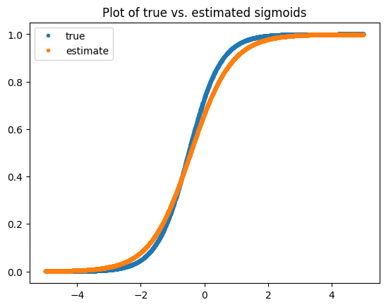

For non-stationary distributions, it may be beneficial to learn (at least some) parameters for your models online. A common approach is to learn a logistic regression model for binary outcomes, and this technique appears as early as [2008 at Yahoo! News](https://dl.acm.org/doi/10.5555/2981780.2981783). There are several approaches to deriving the model weights distribution online, which additionally enables one to perform exploration via Thompson Sampling. Crucially, whatever method must estimate both the mean of the model parameters and their covariance. 

There are a few documented approaches in the literature. [One approach](https://papers.nips.cc/paper_files/paper/2011/file/e53a0a2978c28872a4505bdb51db06dc-Paper.pdf) uses the [Laplace approximation](https://en.wikipedia.org/wiki/Laplace%27s_approximation), a second order expansion of the joint distribution of target variable and the model parameters. A [second approach](https://arxiv.org/pdf/1605.05697), which we follow here, is to leverage a Taylor expansion during the Bayesian update formula, aiming to maintain a better approximation via the linear term in the expansion, which is missing from the Laplace approximation.

## Predicting the Click-Through Rate Online

A user click in the usual setting is modeled as a Bernoulli random variable. A typical approach to learn a click model is [logistic regression](https://en.wikipedia.org/wiki/Logistic_regression#:~:text=Logistic%20regression%20is%20a%20supervised,based%20on%20patient%20test%20results.). In particular, if we have a variable $$y$$ and features $$x$$, we assume the probability of a click is given via

$$ p(y=1 |x) = \sigma(x^T\beta),$$

with $$\sigma$$ being the sigmoid function. If we consider the Bernoulli likelihood function, then the likelihood for a datapoint $$D=\{(x_i, y_i)\}$$ (using $$i$$ as the single subscript to differentiate the datapoint from the variables $$x$$ and $$y$$) is

$$\begin{align}L(\beta ; D) =& p(D|\beta) = p_\beta (y_i | x_i) =  p_\beta(y=1|x_i)^{y_i} (1-p_\beta(y=1|x_i))^{1-y_i}\\
=& \sigma(x_i^T\beta)^{y_i} (1-\sigma(x_i^T\beta))^{1-y_i}
\end{align}$$

yields the usual log-likelihood loss function via

$$\text{log} L(\beta ; D) = y_i\text{log} \sigma(x_i^T\beta) + (1-y_i) \text{log}(1-\sigma(x_i^T\beta)):= \ell_\beta (y_i, x_i),$$

where we maintain the $$\beta$$ subscript for clarity.

With this background, we can derive a Kalman filter update formula for a click model leveraging logistic regression from first principles. As in [the last post](/2025-03-19-Comparing-Online-Linear-Regression-and-Kalman-Filter-methods) on the topic, we will begin from Bayes theorem and derive the update. We let $$D_t:= \{ (x_i,y_i) \}_{i \leq t}$$. The update is given by

$$p(\beta | D_t) \propto p(y_t | \beta, D_{t-1}) p(\beta | D_{t-1}).$$

By taking the log, we have that
$$\text{log} p(\beta | D_t) \propto \ell_\beta(y_t, x_t) + \text{log} p(\beta | D_{t-1}).$$


Using [the wiki notation](https://en.wikipedia.org/wiki/Kalman_filter), we again assume 
$$\beta| D_{t-1} \sim \mathbf{N}(\beta_{t-1}, P_{t-1}),$$
but we need to deal with the $$\ell$$ term through a Taylor expansion. In an abuse of notation, I will use partial derivatives of $$\beta$$ to represent the gradient and Hessian. Anyway, we expand $$\ell$$ around $$\beta_{t-1}$$,
$$\begin{align}
\ell_\beta(y_t, x_t) = \ell_{\beta_{t-1}}(y_t,x_t) + \frac{\partial}{\partial \beta}& \ell_{\beta_{t-1}}(y_t,x_t)^T (\beta-\beta_{t-1})\\ &+ \frac{1}{2}(\beta-\beta_{t-1})^T\frac{\partial^2}{\partial \beta^2} \ell_{\beta_{t-1}}(y_t,x_t) (\beta-\beta_{t-1}).\end{align}
$$

As we are in log-space, $$\ell_{\beta_{t-1}}(y_t,x_t)$$ can be absorbed into the normalizing constant, and combined with the assumption on $$\beta \vert D_{t-1}$$, we have

$$\begin{align}
\text{log} & p(\beta | D_t) \propto \frac{\partial}{\partial \beta} \ell_{\beta_{t-1}}(y_t,x_t) (\beta-\beta_{t-1}) + \frac{1}{2}(\beta-\beta_{t-1})^T\frac{\partial^2}{\partial \beta^2} \ell_{\beta_{t-1}}(y_t,x_t)^T (\beta-\beta_{t-1}) \\& - \frac{1}{2}(\beta-\beta_{t-1})^T P_{t-1}^{-1} (\beta-\beta_{t-1}).\\
=&\frac{\partial}{\partial \beta} \ell_{\beta_{t-1}}(y_i,x_i) (\beta-\beta_{t-1}) - \frac{1}{2}(\beta-\beta_{t-1})^T \left ( P_{t-1}^{-1} -\frac{\partial^2}{\partial \beta^2} \ell_{\beta_{t-1}}(y_t,x_t) \right ) (\beta-\beta_{t-1}).
\end{align}$$

(For the mathematically mature reader, this is not a complete argument. One can also show that these two likelihoods converge in [total variation](https://en.wikipedia.org/wiki/Total_variation_distance_of_probability_measures) a-la a [Bernstein-von Mises style](https://en.wikipedia.org/wiki/Bernstein–von_Mises_theorem) argument, but we will omit this. One can similarly use [Kullback-Leibler Divergence](https://en.wikipedia.org/wiki/Kullback–Leibler_divergence) as it bounds the total variation via [Pinsker's Inequality](https://en.wikipedia.org/wiki/Pinsker%27s_inequality). This is the same approach used to justify the Laplace approximation.)

In order to derive the update, we must simpifly this expression via completing the matrix square to become of the form

$$ -\frac{1}{2}(\beta- \beta_t)^T P_{t}^{-1} (\beta- \beta_t).$$

The easiest way to see the final formula, is to let $$a = \beta-\beta_{t-1}$$, $$C=\left ( P_{t-1}^{-1} -\frac{\partial^2}{\partial \beta^2} \ell_{\beta_{t-1}}(y_i,x_i) \right )$$, and $$h$$ be an unknown we are solving for. Note that $$C$$ by definition is symmetric and positive definitie since it the sum of a Hessian and covariance matrix. Now, we want to find a formula such that our log probability simplifies to

$$-\frac{1}{2}(a-h)^T C (a-h).$$

By pairing the linear terms from the previous equation and $$\text{log} p(\beta | D_t)$$ together, we have that 
$$-h^T C a = b^T a,$$
or in other words we can choose $$h^T = - b^T C^{-1}.$$

This will give us the update formula (for $$\beta_t$$ subbed in for $$\beta$$ in this context):

$$ P_{t} = \left ( P_{t-1}^{-1} -\frac{\partial^2}{\partial \beta^2} \ell_{\beta_{t-1}}(y_t,x_t) \right )^{-1} \text{ and}$$ 

$$ \beta_t = \beta_{t-1} + \frac{\partial}{\partial \beta} \ell_{\beta_{t-1}}(y_t,x_t) P_{t}.$$

To finish the derivation for logistic regression, we have to note the formulas for the derivatives. The paper has simplifications of $$P_t$$ based on a variance of [Woodbury's formula](https://en.wikipedia.org/wiki/Woodbury_matrix_identity).

For our implementation, notice that 

$$ \frac{\partial}{\partial \beta}  \ell_{\beta_{t-1}}(y_t,x_t) =  (y_t - \sigma(x_t^T \beta)) x_t^T,$$

and the Hessian is given by

$$ \frac{\partial^2}{\partial \beta^2}  \ell_{\beta_{t-1}}(y_t,x_t) =  \sigma(x_t^T \beta)(1 - \sigma(x_t^T \beta)) x_t x_t^T.$$

We will also rewrite $$P_t$$ by the [Sherman-Morrison formula](https://en.wikipedia.org/wiki/Sherman–Morrison_formula):

$$P_t = \left ( P_{t-1}^{-1} -\frac{\partial^2}{\partial \beta^2} \ell_{\beta_{t-1}}(y_t,x_t) \right )^{-1} = \left ( P_{t-1} - \frac{\sigma(x_t^T \beta)(1 - \sigma(x_t^T \beta)) P_{t-1}x_t x_t^TP_{t-1} }{1+\sigma(x_t^T \beta)(1 - \sigma(x_t^T \beta)) x_t^T P_{t-1} x_t}    \right ). $$


## Implementation and Validation

Here, we will generate some toy data and fit an OLR model via the Kalman filter formula above. This will give us a reasonable estimate for the coefficients as you will see below in the plot of the actual vs. estimated sigmoid function. The data generation is as follows:


```python
# Data generation
import numpy as np

def sigmoid(x):
    return 1./(1+np.exp(-x))
    
n=5000
a=2
b=1

# Generate simulated logodds and clicks
xs = np.random.uniform(-5,5,size=n) # some feature that determines the probability
logodds = a*xs+b # parametrized logodds, one independent variable plus a bias
y = np.random.binomial(p=sigmoid(logodds), n=1) # click stream based on the probability implied by logodds

```


```python
# Implementation
class KalmanFilter:

    def __init__(self):
        
        self.beta = np.array([[0], [0]])  # initial weights guess CTR ~ 1
        self.P = 0.1 * np.eye(2)  # initial covariance, a guess
        self.n = 0

    def predict(self, xj, **kwargs):
        x = np.array([[1],[xj]]).T
        return sigmoid(x @ self.beta)
    
    def update(self,xj,yj):
        
        x = np.array([[1],[xj]])

        # Extended Kalman Filter H, derivative of tmp_H w.r.t. the weights x
        p_op = (sigmoid(x.T @ self.beta) * (1-sigmoid(x.T @ self.beta)))[0][0]
        outerx = x @ x.T
        dldb = (yj - sigmoid(x.T @ self.beta)[0][0])*x.T

        self.P = self.P - (p_op * (self.P @ outerx @ self.P))/(1+p_op* x.T @ self.P @ x) #updated covariance
        self.beta = self.beta + (dldb @ self.P).T  # updated mean estimate, stay 2x1
        self.n += 1
        
        return yj - sigmoid(x.T @ self.beta)[0][0], self.beta

```


```python
# Fitting!
kf = KalmanFilter()

for j in range(n):
    xj = xs[j]
    yj = y[j]
    
    kf.update(xj=xj, yj=yj)
```


```python
kf.beta # looking for [1,2]
```


    array([[0.68176588],
           [1.5627812 ]])


```python
import matplotlib.pyplot as plt
```


```python
plt.title('Plot of true vs. estimated sigmoids')
plt.plot(xs,sigmoid(a*xs+b),'.')
plt.plot(xs,sigmoid(kf.beta[1][0]*xs+kf.beta[0][0]),'.')
plt.legend(['true', 'estimate'])
```

    

    


We can see that the $$\beta$$ we found is not quite right, but we actually have plenty of data to learn this term as we will see below. The problem is that our likelihood estimate is noisy as we only have a single datapoint. Let's try to improve it via batching! Note, if we were to just get more samples this version would converge better too.

### Improving the Estimate via Batching

The formula I derived assumed a single new example per update. Generally, you will use many examples per update, i.e., $$D_t=\{(x_{t,i}, y_{t,i})\}_{i=1}^n$$. This will only impact the likelihood (and then subsequently the loss) term. In particular, the likelihood will now be 

$$L(\beta ; D_t) = \prod_{x_i, y_i \in D_t} p_\beta (y_i | x_i) = \prod_{x_i, y_i \in D_t} \sigma(x_i^T\beta)^{y_i} (1-\sigma(x_i^T\beta))^{1-y_i}$$

with $$y_{t,i}:= y_i$$ and $$x_{t,i}:= x_i$$, and this yields the usual log-likelihood loss function when taking the logarithm:

$$\text{log} L(\beta ; D_t) = \sum_{i=1}^n y_i\text{log} \sigma(x_i^T\beta) + (1-y_i) \text{log}(1-\sigma(x_i^T\beta)):= \ell_\beta (y_t, x_t).$$

The only thing you will need to update in your final formula is the gradient and the Hessian. The gradient, whose dimension is equal to $$\beta$$, is given by

$$ \frac{\partial}{\partial \beta} \ell_{\beta_{t-1}}(y_t,x_t) =  \sum_{i=1}^n (y_{t,i} - \sigma(x_{t,i}^T \beta)) x_{t,i}^T = B_t(\beta)^T X_t $$

where $$X_t$$ is the design matrix, whose $$i$$-th row is equal to $$x_{t,i}$$, the vectors $$y_t:=[y_{t,i}]_{i=1}^n$$ and $$B_t(\beta) := y_{t} - \sigma(X_t \beta)$$, and the Hessian is given by

$$ \frac{\partial^2}{\partial \beta^2}  \ell_{\beta_{t-1}}(y_t,x_t) =  \sum_{i=1}^n \sigma(x_{t,i}^T \beta)(1 - \sigma(x_{t,i}^T \beta)) x_{t,i} x_{t,i}^T:= X_t^T W(\beta) X_t$$

where $$W_t(\beta) := \text{diag}\left ( \sigma(X_t \beta) \odot (1 - \sigma(X_t \beta)) \right)$$ 

with $$\odot$$ being element-wise multiplication. To understand why, it may help to remember the identity we discussed in the previous post-- $$X^T X = \sum_{i=1}^n x_i x_i^T$$.

Although the update for $$\beta_t$$ stays essentially the same, for $$P_t$$ you now must use a version of the [Woodbury formula](https://en.wikipedia.org/wiki/Woodbury_matrix_identity) from [The Matrix Cookbook](https://www.math.uwaterloo.ca/~hwolkowi/matrixcookbook.pdf) (Section 3.2.2 equation 156):

$$(A + CBC^T)^{-1} = A^{-1} - A^{-1} C ( B^{-1} + C^T A^{-1} C)^{-1} C^T A^{-1}.$$

However, this requires you to calculate a pesky inverse matrix without a clean formula, i.e., the term $$( B^{-1} + C^T A^{-1} C)^{-1}$$. A simpler approach is to use this formula for $$(A+B)^{-1}$$ which comes from [this paper](https://www.jstor.org/stable/2690437), namely when $$A$$ and $$A+B$$ are invertible and the trace of $$BA^{-1}\neq 1$$,

$$(A+B)^{-1} = A^{-1} + \frac{1}{1 + \text{tr}(BA^{-1})} A^{-1} B A^{-1}.$$

If we assume invertibility (which is usually how this argument goes, or you use a pseudo-inverse), then in our case,

$$ \beta_t = \beta_{t-1} + B_t(\beta)^T X_t P_{t}$$

and 

$$P_{t} = P_{t-1} - \frac{1}{1-\text{tr}(H P_{t-1})} P_{t-1} H P_{t-1}.$$


Note, as the loss function is convex the Hessian will be positive semi-definite. If it happens to be positive definite, it will be invertible. You can also check invertibility if you are concerned but that's computationally expensive and our goal was to not compute any explicit inverses.

<!-- 
$$P_t = \left ( P_{t-1}^{-1} -\frac{\partial^2}{\partial \beta^2} \ell_{\beta_{t-1}}(y_t,x_t) \right )^{-1} = \left ( P_{t-1} - P_{t-1} X^T_{t} ( W_t(\beta)^{-1} + X P_{t-1} X_t^T)^{-1} X P_{t-1} \right ), $$ -->
<!-- which only requires the inverse of a diagonal matrix and of $$W_t(\beta)^{-1} + X P_{t-1} X_t^T$$.
 -->


```python
class BatchKalmanFilter:

    def __init__(self):
        
        self.beta = np.array([[0], [0]])  # initial weights guess CTR ~ 1
        self.P = 0.1 * np.eye(2)  # initial covariance, a guess
        self.n = 0
        
    def predict(self, xj, **kwargs):
        x = np.array([[1],[xj]]).T
        return sigmoid(x @ self.beta)
    
    def update(self,xjs,yjs):

        # form big X from the equation
        yj = np.array(yjs).T # (n,)
        X =  np.array([[1]*len(xjs),xjs]).T # (3,2)

        # gradient
        dldb = (yj-sigmoid(X @self.beta).T ) @ X # (1,2)

        # hessian
        p=sigmoid(X @ self.beta).T
        W = np.diag( (p * (1-p))[0]) # elementwise (1,n)
        H = X.T @ W @ X

        HP = H @ self.P
        tr = np.trace(HP)
        

        self.P = self.P - (1/(1-tr))*self.P @ HP
        self.beta = self.beta + (dldb @ self.P).T  # updated mean estimate, stay 2x1
        self.n += 1
        return np.mean(yj - sigmoid(X @ self.beta)), self.beta

```


```python
bkf = BatchKalmanFilter()

batch_size=16
for j in range(int(n/batch_size)):
    bx = xs[j*batch_size:(j+1)*batch_size]
    by = y[j*batch_size:(j+1)*batch_size]
    
    bkf.update(xjs=bx, yjs=by)
```


```python
bkf.beta # looking for [1,2]!
```


    array([[0.87903741],
           [1.93746192]])


```python
plt.title('Plot of true vs. estimated sigmoids')
plt.plot(xs,sigmoid(a*xs+b),'.')
plt.plot(xs,sigmoid(bkf.beta[1][0]*xs+bkf.beta[0][0]),'.')
plt.legend(['true', 'estimate'])
```


    

    


You can see that the batch version seems to converge better, likely due to the stronger estimate of the likelihood function. With this function, we will be able to learn a logistic regression model online via a Kalman filter, which will also learn an estimate for the variance of the estimate, which one would need to employ *Thompson Sampling* for exploration.

