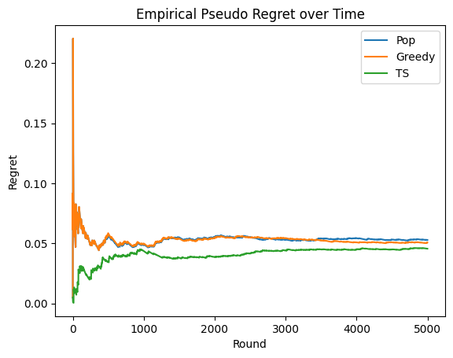
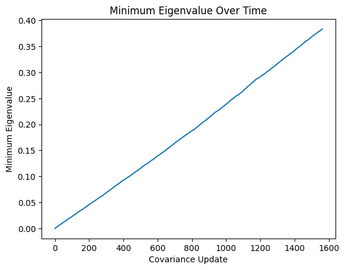

In the last post, we looked at an iterative online update to a logistic regression model. This derivation requires knowledge of the derivative with respect to the model's weights, which is intractible for more complicated models. In practice, one wants to use neural networks for prediction tasks for ads or recommendation systems. The question becomes what is the right techniques to apply in order to perform Thompson Sampling with a neural network to enable exploration.

## How to Use Thompson Sampling with Neural Networks


It turns out that the [most modern solution by Su et al. from Google](https://arxiv.org/pdf/2305.07764) (as of 2025) I've found combines two previous techniques with a slight twist. First, they start with [Neural Linear Bandits](https://arxiv.org/pdf/1802.09127). This algorithm is both clever, and in many ways, simple. Since neural networks are too complex to model analytically, they instead take the last hidden layer's output as the (non-random) feature inputs to a linear regression model and learn the regression coefficients online. This allows the practitioner to maintain a covariance matrix for Thompson sampling based on the last embedding layer of the model. We are now left with a question of extending this linear model to classification tasks and how to update the model effectively. The answer partially comes from the Upper Confidence Bound (UCB) literature, which has a thread of research culminating in using stochatic gradient descent (SGD) to learn the weights of generalized linear model and while maintaining a covariance matrix based on the inputs. The Google solution finally extends this SGD approach to neural networks, yielding the method described below.

### Neural Linear Bandits

Neural linear uses [adaptive Bayesian networks](https://arxiv.org/pdf/1502.05700) to learn a (linear!) reward model. Let $$x$$ be our input data (think of this as a combination of the user $$u$$ and the action $$a$$) and $$\phi(x) \in \mathbb{R}^m$$ the output of the last layer of the (pre-trained) neural network. The approach assumes that $$\phi(x)$$ is non-random, and the only randomness comes from a parameter $$\beta$$ in the reward formula

$$y = \phi(x)^T \beta $$

for an activation function $$\mu$$. Let $$\text{var}(\beta)=\Sigma$$ and $$\sigma^2$$ be a noise parameter, then
$$
y | \phi \sim \mathbb{N}\left ( \phi(x)^T \beta, \sigma^2 \phi(x)^T \Sigma^{-1} \phi(x) \right ),
$$
and a derivation can be found [here](https://arxiv.org/pdf/1502.05700). The variance is equal to $$\sigma^2\| \phi(x) \|_{\Sigma^{-1}}$$, where $$\Sigma= \sum_i x_i x_i^T$$ where the sum is up to the current timestep. We will see that term later in the UCB derivation. In [Google's paper](https://arxiv.org/pdf/2305.07764), they derive a closed form iterative update which is very similar to the online linear regression we derived in a previous post. However, their derivation only works for linear bandits, and in many practical applications one instead is dealing with binary output (clicks, buys, etc.). So far, we are unable to use this idea to extend to classification tasks, but we are nearly there once we add in an activation function. In particular, we will look at the equation 

$$y = \mu \left (\phi(x)^T \beta \right ) $$

to model the reward. Now we have to figure out how to solve for $$\beta$$ in an easier manner than a full-blown optmization. We will see this in the next section, and we will actually rely on the input to the logit layer for our covariance matrix, which allows us to keep a linear-like update formula for the covariance.

### Model Updates from UCB

#### GLM-UCB

We can actually trace this approach back to an early paper from 2010 on [GLM-UCB](https://papers.nips.cc/paper_files/paper/2010/file/c2626d850c80ea07e7511bbae4c76f4b-Paper.pdf). In this paper, they combined UCB with generalized linear models and proved a regret bound. Let's start with some notation but we wil assume you are familiar with notation from the previous posts on the topic. We will modify the notation from earlier papers to align with the recent Google paper for clarity. In this case, we consider a suite of models, one for each action $$a \in A$$. The estimated reward model for an action $$a$$ is parametrized by the formula

$$ y_a = \mu ( x_a^T\beta )$$
for a generalized linear function $$\mu$$ and $$\beta \in \mathbb{R}^n$$. Note, that $$\beta$$ is used for all actions (this will be important later!). If we have a batch of data $$y_i, x_i, a_i \in D$$, let the design matrix for the linear problem be $$X$$ is you stacked the $$x_i$$ vectors for all datapoints. For a matrix $$M$$, define the norm $$\| x \|_M = \sqrt{ \| x^T M x \| }$$ and let $$\rho(t)$$ be an increasing function in $$t$$. The paper shows that the following algorithm will solve the bandits problem and give a regret estimate:

1. Input $$\{ x_a \}_{a \in A}$$.
2. For $$t \leq d$$: Play actions $$a_1,\dots, a_n$$, observe rewards $$y_i$$ with inputs $$x_i$$.
3. For $$t > d$$:
    1. Define $$\Sigma_t = \sum_{i=1}^{t-1} x_i x_i^T$$.
    2. Solve for $$\beta^*$$ as the argmin of 
      $$ \beta^* := \text{argmin}_{\hat\beta} \left \| \sum_{i=1}^{t-1} \left (y_i - \mu (x_i^T \hat\beta ) \right ) x_i  -  \sum_{i=1}^{t-1} y_i x_i \right \|_{\Sigma_t^{-1}} $$.
    3. Play $$a_t = \text{argmax}_{a} \mu ( x_a^T \beta^*) + \rho(t) \| x_a \|_{\Sigma_t^{-1}}$$ and obseve reward $$y_t$$, store $$x_t$$.

It turns out that this will work for solving generalized linear problems. The model performed better than the regret analysis implied, and the its regret bound was eventually improved [in this paper by Li et. al](https://arxiv.org/pdf/1703.00048). However, a few very important ideas were explored here. First, notice that for each action, there is a fixed non-random $$x_a$$ associated with that action, which comes into play in the upper bound term $$\rho(t) \| x_a \|_{\Sigma_t^{-1}}$$. This upper bound term is very similar to the variance term we saw in the neural linear algorithm. Moreover, notice that the upper bound has nothing to do with $$\mu$$, and if $$\mu$$ was the sigmoid function, you could say that the upper bound only relates to the variability of the input features. This is very important. Finally, they solve for a univeral $$\beta$$ using the available data from all the arms. This is different from modeling a different independent linear model for each action, which was used in variants of algorithms such as Algorithm 1 by [Li et al.](https://arxiv.org/pdf/1003.0146) or in the [logistic regression case](https://papers.nips.cc/paper_files/paper/2011/file/e53a0a2978c28872a4505bdb51db06dc-Paper.pdf). However, solving the optimization problem is difficult and annoying at scale, and these algorithms assume a generalized linear form which is restricting in practice.

Now we want to find a better form for the model than $$\mu ( x^T \beta)$$ which will be more flexible, and secondly we'd like to not have to solve an optimization problem to find $$\beta$$ while still sampling from the linear logits. From the previous section on neural linear, a natural extension is to define the input to this approach to be $$\mu ( \phi(x)^T \beta)$$ where $$\phi$$ is the last embedding layer of the neural network and $$\beta$$ is the head outputting the final logit. The question becomes how do we learn such parameters.

#### Using SGD for Learning Model Parameters

To extend to classification tasks (adding a sigmoid activation), [Google's paper](https://arxiv.org/pdf/2305.07764) provides an algorithm that itself is based on [SGD-TS](https://arxiv.org/pdf/2006.04012)-- an aptly technique combining stochastic gradient descent with Thompson sampling. This approach works nicely with neural networks: rather than trying to find a closed form solution to the model parameter updates, the authors use SGD to approximate the $$\beta$$ term above and then derivate an estimate for the variance from the linear logit output. 

In particular, if we let 

$$y = \mu \left (\phi(x)^T \beta \right ) $$

then the SGD update will learn both an update for $$\phi$$'s weights and $$\beta$$. The Google paper uses a different estimate for the covariance which they claim is a better approximation. Algorithm 1 in [Google's paper](https://arxiv.org/pdf/2305.07764) provides the basis of the implementation below, where I combine Thompson sampling with a neural network to simulate a standard recommendation problem. 

## Algorithm

Now, we will present the high level algorithm used for training and serving of a neural network for CTR prediction. Of course, $$\mu$$ will be the sigmoid function in this case.

There are some caveats to be aware of. First, you must choose the parameters $$\epsilon$$ and $$\sigma^2$$. The Google papers has their default settings. $$\epsilon$$ helps ensure that $$\Sigma_0:= \epsilon I$$ is invertible and controls initial exploration along with $$\sigma^2$$. The model weights $$\phi_0$$ and $$\beta_0$$ can be initialized from the production policy. 

### Serving
For serving to generate logged feedback $$D_t$$ via:
1. Input $$\phi_{t-1}$$, $$\beta_{t-1}$$, $$\Sigma_{t-1}$$.
2. Generate data for the batch $$B_t:= \{1,\dots,n\}$$. For each $$i$$,
    1. Input user $$u_i$$.
    2. For each candidate $$a_k$$, sample from the logit distribution, $$l_{a_k} = \mathbb{N}(\phi_{t-1}(x_{u_i,a_k})^T \beta_{t-1}, \sigma^2 \phi_{t-1}(x_{u_i,a_k})^T \Sigma_{t-1}^{-1} \phi_{t-1}(x_{u,a_{k}}))$$.
    3. Present top $$K$$ actions, ordered by $$\mu(l_{a_k})$$. Denote these actions $$a_{i,k}$$. Observe rewards $$y_{i,k}$$ for each presented action.

Next, we will abuse notation and set the data for $$i$$-th user and $$k$$-th displayed action $$x_{i,k}:=x_j$$ where $$j=1,\dots, Kn$$.


### Training
For training phase on the logged feedback $$D_t$$: 

Let $$\Sigma_{t,0}= \Sigma_{t-1}$$, $$\phi_{t,0}=\phi_{t-1}$$, and $$\beta_{t,0}=\beta_{t-1}$$.
For each minibatch $$B_{t,h}:=\{ (x_i, y_{i}) \}_{i=1,\dots Kn}$$, $$h=1,..,H$$:
1. Update $$\Sigma_{t,h} = \Sigma_{t,h-1} + \sum_{i=1}^{Kn} \phi_{t,h-1}(x_i) \phi_{t,h-1}(x_i)^T$$.
2. Solve for $$\phi_{t,h}$$ and $$\beta_{t,h}$$ via SGD on the batch of $$Kn$$ datapoints.

Update $$\phi_t = \phi_{t,H}$$, $$\beta_{t} = \beta_{t,H}$$ and $$\Sigma_t = \Sigma_{t,H}$$. Calculate the inverse via the pseudoinverse $$\Sigma_t^{-1}:= \Sigma_t^\dagger$$.
  
Note, that in the real algorithm, they choose to use the psuedoinverse denoted $$\Sigma^\dagger$$ to deal with cases where $\Sigma$ is singular or close to singular. 

### Practical Considerations

The paper does not discuss long term maintenance of the model. In some reinforcement learning settings, a replay is buffer is used for continuing training. However, my guess is that the model is periodically "reset" via a regular training and the exploration begins again. Another important thing to keep in mind is the training algorithm above can only be data from the production exploration policy, as all online models must be trained on their own feedback data. The paper does not mention using multiple epochs for the batched training, and the covariance matrix update certainly should not be updated multiple times from the same data. It seems likely that the authors intended for a single training pass over each logged feedback dataset $$D_t$$. It's also possible that you can have different training regiments between the bottom layers and the head weights, as indicated by footnote 12 in the Google paper. 

In terms of monitoring over time, the UCB algorithm expects the minimum eigenvalue of $$\lambda_{min}(\Sigma_t)\to\infty$$ as $$t\to\infty$$ to indicate "diverse" enough exploration, which is one of the requirements to prove GLM models are [consistent](https://projecteuclid.org/journals/annals-of-statistics/volume-27/issue-4/Strong-consistency-of-maximum-quasi-likelihood-estimators-in-generalized-linear/10.1214/aos/1017938919.full). The minimum eigenvalue actually appears in the regret bounds in [many](https://proceedings.mlr.press/v70/li17c/li17c.pdf) [papers](https://papers.nips.cc/paper_files/paper/2011/file/e1d5be1c7f2f456670de3d53c7b54f4a-Paper.pdf) and is one of the offsetting factors in regret growth over time. This [paper](https://papers.nips.cc/paper_files/paper/2010/file/c2626d850c80ea07e7511bbae4c76f4b-Paper.pdf) comments in Section 2 that a sufficient measure is that the design matrix $$\sum_i x_i x_t^T\to\infty$$. You can see in the UCB algorithm above that this would lead the exploration term to tending to $$0$$ over time.


## Empirical Validation


In order to see our algorithm in action, we need to calculate the empirical (pseudo) regret over a simulation. The pseudo-regret is the expected difference from always playing the optimal arm. To this end, we design a small recommendation system simulation to allow us to know the exact preferences of the user for each item. We will calculate (empirical) pseudo-regret via

$$R_T = \frac{1}{T}\sum_{t=1}^T \mathbb{E}(r | a_t^*) - r_{a_t}$$

where $$a_t^*$$ is the optimal action at time $$t$$ and $$r_{a_t}$$ was the reward received when playing action $$a_t$$. This can be shown to converge to the true regret as commented [here](https://arxiv.org/pdf/1904.02664).

To "pretend" we began training at a "production" policy, we will give both models a noisy version of the user and item matrix as their base embeddings (although these are transformed by downstream layers).

### Simulation Design and Expected Reward

sdadasdsa

We simulate this as follows: We have a user matrix $$U \in \mathbb{R}^{m\times d}$$ and an item matrix $$L \in \mathbb{R}^{d\times k}$$ where $$d$$ indicates the embedding dimension for both users and items. The matrix $$UL$$ is our user preference matrix. The environment will give us a user $$u$$ drawn at random, and then 500 items $$i$$ to rerank. The top $$10$$ item will be "shown" to the user and click feedback logged. The The probability that a user will click item $$i$$ presented at the $$k$$-th slot is given by

$$
p(\text{click } i \mid \text{slot } k,\; \text{user}=u)
      = \frac{e^{u^{\top} i/\tau}}
             {\sum_j e^{u^{\top} i_j/\tau}}
        \cdot p(\text{click}\mid\text{slot}=k),
$$

where $$\tau$$ is a temperature parameter, $$a$$ is the ordering, and the second probability is the positional bias at $$k$$. To simulate the user's response, the user "looks" at the top $$k$$ items in order and flips a coin (using the derived probability) to determine if the user clicks on that item or not. If the user does click, then the round ends and the reward ($$=1$$) is assigned to that item. Otherwise the reward is $$0$$. Thus, the expected maximal reward per round is given via taking the optimal ranking based on the user's preferences and calculating the probability of a click, 

$$E[r | u, a^*] = p(\text{click} |\text{user} = u, a^*) = 1-\prod_{k}(1-p( \text{click item $i_k$ | slot $k$, u})).$$


```python
import numpy as np
np.random.seed(32)
n_users = 1000
n_items = 10000
embedding_size=32
n_rounds=5000
temperature = .001
top_k = 10
retrieved_items = 500
position_bias = 1/np.arange(1,top_k+1)
user_matrix = np.random.uniform(-.1,.1, size=(n_users,embedding_size))
item_matrix = np.random.uniform(-.1,.1, size=(n_items,embedding_size)) # N+1 = no click
```


```python
# Get and idea of what preferences look like
user_matrix[0] @ item_matrix[[0,3,23]].T / temperature
```


    array([-7.87661526, 12.86708253, 20.99510362])


```python
class OptimalRanking:
    
    def get_ordered_actions(self, user, arms):
        user_prefs = (user_matrix[user] @ item_matrix[arms].T).tolist()
        t = sorted(zip(arms,user_prefs), key=lambda x : x[1], reverse=True)
        arms, _ = zip(*t)
        return list(arms)

    def update_arm(*args, **kwargs):
        pass
```


```python
def get_expected_reward(user,items):
    opt_order = OptimalRanking().get_ordered_actions(user,items)
    t = np.exp(user_matrix[user] @ item_matrix.T / temperature)    
    sampled_arms_p = t[opt_order] / t.sum()

    p_click = 1
    for k in range(top_k):
        p_click *= (1-position_bias[k]*sampled_arms_p[k])
    exp_reward = 1-p_click # E[click]
    return exp_reward
```


```python
def run_round(policy, user, items, user_matrix, item_matrix, top_k):
    
    # model reranks items
    arms = policy.get_ordered_actions(user, items)

    t = np.exp(user_matrix[user] @ item_matrix.T/temperature)    
    sampled_arms_p = t[arms] / t.sum()

    selected_arm = None
    for k in range(top_k):
        arm = arms[k]
        sampled_p = position_bias[k]*sampled_arms_p[k]
        click = np.random.binomial(1, p=sampled_p)
        if click > 0:
            selected_arm = arm
            break
        
    if selected_arm is not None:
        # only top 10 are shown
        reward = 1
        arm_rank = np.where(selected_arm == arms)[0][0]
    else:
        reward = 0
        arm_rank = None
    
    return reward, selected_arm, arm_rank, user, arms[:top_k] #top k only
```


```python
### Now the actual code to run an experiment and track regret
def run_experiment(policy):
    np.random.seed(42) # same list of users for each experiment
    regret= []
    
    for k in range(n_rounds):
    
        # system selects user
        user = np.random.choice(n_users)
        
        # retriever returns items
        items = np.random.choice(n_items, size=retrieved_items)
    
        exp_reward = get_expected_reward(user,items)
            
        reward, clicked_item, arm_rank, user, arm_list = run_round(policy, user, items, user_matrix, item_matrix, top_k)
        policy.update_arm(arm=clicked_item, reward=reward, user=user, arm_list=arm_list)

        regret.append(exp_reward - reward)

    return np.cumsum(regret) / np.cumsum(np.ones(len(regret)))

```

### Implementing the Ranking Models


```python
# Popularity baseline

class GlobalPopRankingModel:
    def __init__(self, n_users, n_items):
        self.item_click = {}
        self.item_total = {}

    def get_ordered_actions(self, user, arms):
        p = [self.item_click.get(a,0) / self.item_total.get(a,1) for a in arms]
        t = sorted(zip(arms,p), key=lambda x : x[1], reverse=True)
        arms, _ = zip(*t)
        return list(arms)
    
    def update_arm(self, arm, reward, user, arm_list):
        for a in arm_list:
            self.item_total[a] = self.item_total.get(a,0) + 1
            self.item_click[a] = self.item_click.get(a,0) + reward if arm == a else 0

```


```python
# Model trained via Algorithm 1
class BatchTsRankingModel(nn.Module):
    def __init__(self, n_users, n_items, k_latent=5, buffer_size=32, batch_size=4):
        super().__init__()
        # Assume model basically knows the users and items, plus noise
        self.user_emb  = nn.Embedding.from_pretrained(torch.as_tensor(user_matrix, dtype=torch.float), freeze=False)
        self.item_emb  = nn.Embedding.from_pretrained(torch.as_tensor(item_matrix, dtype=torch.float), freeze=False)

        self.model = nn.Sequential(
            nn.Linear(2*k_latent, k_latent),
            nn.ReLU(),
            nn.Linear(k_latent, int(k_latent/2))
        )
        
        self.output_layer = nn.Linear(int(k_latent/2), 1)

        self.items = torch.as_tensor(range(n_items), dtype=torch.long)
        self.n_items = n_items
        self.optimizer = torch.optim.SGD(self.parameters())#, lr=5e-2, weight_decay=1e-6)
        self.loss_fn   = nn.BCEWithLogitsLoss()
        self.epoch_loss = 0
        self.steps = 0

        # Covariance stuff
        self.cov = 1e-6*np.eye(int(k_latent/2))
        self.inv_cov = np.linalg.pinv(self.cov)
        self.noise = .01**2 # \sigma^2
        self.counter = 0
        self.buffer_size = buffer_size
        self.batch_size = buffer_size
        self.user_buffer = [None]*buffer_size
        self.arm_buffer = [None]*buffer_size
        self.target_buffer = [None]*buffer_size
        self.min_eigs = []

    def forward(self, u, i):
        emb = self.get_last_hidden_layer(u,i)
        logit = self.output_layer(emb)
        return logit.squeeze()
        
    def get_last_hidden_layer(self, u, i):
        if not torch.is_tensor(u):
            if isinstance(u, list):
                u=torch.as_tensor(u,dtype=torch.long)
            else:
                u=torch.as_tensor([u],dtype=torch.long)
        if not torch.is_tensor(i):
            if isinstance(i, list):
                i=torch.as_tensor(i,dtype=torch.long)
            else:
                i=torch.as_tensor([i],dtype=torch.long)
        inputs = torch.concat(
            (self.user_emb(u).squeeze(-1), self.item_emb(i).squeeze(-1)),-1
            )
        emb = self.model(inputs)
        return emb

    def get_ordered_actions(self, user, arms):
        with torch.no_grad():
            mu = self.forward(torch.as_tensor([user]*len(arms)),torch.as_tensor(arms)).detach().numpy()  # score it all!

            # batched calculation of last hidden layer and covariance matrix formula
            phis = self.get_last_hidden_layer(torch.as_tensor([user]*len(arms)),torch.as_tensor(arms))
            stds = torch.sqrt(self.noise*torch.bmm((phis.unsqueeze(1) @ torch.as_tensor(self.inv_cov, dtype=torch.float)), phis.unsqueeze(2)).squeeze()).detach().numpy()

        #sample logit!
        logits = np.random.normal(mu,scale=stds)

        t = sorted(zip(arms,logits), key=lambda x : x[1], reverse=True)
        arms, _ = zip(*t)
        return list(arms)
    
    def update_arm(self, arm, reward, user, arm_list):
        for am in arm_list:
            idx = self.counter % self.buffer_size
            self.user_buffer[idx] = user
            self.arm_buffer[idx] = am # displayed arm
            self.target_buffer[idx] = reward if arm == am else 0.
            if idx == self.buffer_size - 1:
                self._train()
            self.counter += 1
            
        
    def _train(self):
        data = RewardDataset(self.user_buffer, self.arm_buffer, self.target_buffer)
        loader = DataLoader(data, batch_size=self.batch_size, shuffle=True)

        self.train()
        self.zero_grad()
        for u, i, t in loader:
            # Covariance update
            with torch.no_grad():
                for user, arm in zip(u, i):
                    tmp = self.get_last_hidden_layer([user.item()], [arm.item()]).detach().numpy().T
                    self.cov += tmp @ tmp.T

            
            #batch sgd update
            pred  = self(u, i)
            loss  = self.loss_fn(pred, t)
            loss.backward()
            self.optimizer.step()
            self.steps += 1
            self.epoch_loss += loss.item()

        self.inv_cov = torch.as_tensor(np.linalg.pinv(self.cov), dtype=torch.float)

        # log minimum eigenvalues
        self.min_eigs.append(sorted(np.linalg.eigvals(self.cov))[0])

    def get_loss(self):
        return self.epoch_loss / self.steps


class RewardDataset(Dataset):
    def __init__(self, u, i, r):
        self.u = torch.as_tensor(u, dtype=torch.long)
        self.i = torch.as_tensor(i, dtype=torch.long)
        self.r = torch.as_tensor(r, dtype=torch.float)

    def __len__(self): return len(self.r)

    def __getitem__(self, idx):
        return self.u[idx], self.i[idx], self.r[idx]

```


```python
# Model that doesn't do exploration
class GreedyRankingModel(BatchTsRankingModel):

    def get_ordered_actions(self, user, arms):
        with torch.no_grad():
            logits = self.forward(torch.as_tensor([user]*len(arms)),torch.as_tensor(arms)).detach().numpy()  # score it all!

        t = sorted(zip(arms,logits), key=lambda x : x[1], reverse=True)
        arms, _ = zip(*t)
        return list(arms)
```

### Results
<!-- 

```python
regret = run_experiment(GlobalPopRankingModel(n_users, n_items))
regret_b = run_experiment(GreedyRankingModel(n_users, n_items, k_latent=embedding_size))
model = BatchTsRankingModel(n_users, n_items, k_latent=embedding_size)
regret_c = run_experiment(model)
```


```python
print(f"Pop Regret:{regret[-1]}\nGreedy Regret:{regret_b[-1]}\nTS Regret:{regret_c[-1]}")
```
 -->

    Pop Regret:0.052793205414393606
    Greedy Regret:0.05065588473845608
    TS Regret:0.04554225704636146


    

    


From the plot, you can see the improvement of the Thompson sampling network over a global popularity ranking model and a Greedy ranking model.

### Debugging
We can use the "health" of the eigenvalues as a diagnostic tool. When the solution is working, the minimum eigenvalue should be growing as I mentioned before. While creating this simulation, I noticed that the minimum eigenvalue was not growing, and it turned out to be because I was using a ReLU layer before the final linear layer, which caused my embeddings to not span the entire latent vector space, which meant the eigenvectors of the $$\sum_i x_i x_i^T$$ couldn't span the whole space and allow all eigenvalues to grow. In effect, this limited exploration of the model and so the performance of the model was suboptimal. In the literature, this property is referred to as "diverse enough" exploration.

Let us validate this behavior occurs in our implementation:


```python
# Final eigenvalues, notice they are much bigger than 1e-6 which was the starting eigenvalue
np.linalg.eigvals(model.cov)
```


    array([9.55066599e+03, 6.79336837e+02, 2.53629500e+01, 2.26775292e+01,
           1.51141204e+01, 1.34970862e+01, 1.01343297e+01, 8.46653337e+00,
           7.02925179e+00, 4.54538797e+00, 3.83345108e-01, 1.05868713e+00,
           2.77451505e+00, 2.59608666e+00, 1.74925792e+00, 1.76319846e+00])


    

    


Practically, the minimal eigenvalue growing is also essential for shrinking the exploration term, leading to exploitation. Let $$\|x \|_2  = 1$$. In particular, using [Cauchy-Schwarz](https://en.wikipedia.org/wiki/Cauchy–Schwarz_inequality) we can see that the exploration term is bounded above by
$$ \|x\|_{\Sigma^{-1}}^2 = x^T \Sigma^{-1} x \leq \|x \| \|\Sigma^{-1} x\| \leq \|\Sigma^{-1}\| = \lambda_{\max}(\Sigma^{-1})$$
where $$\lambda_{\max}(A)$$ indicates the largest eignevalue of a matrix $$A$$ and because $$\Sigma^{-1}$$ is positive semi-definite.
Note that $$\lambda_{\max}(\Sigma^{-1}) = 1/\lambda_{\min}(\Sigma)$$. Thus the exploration term will go to $$0$$ if $$\lambda_{\min}(\Sigma)\to\infty$$.

